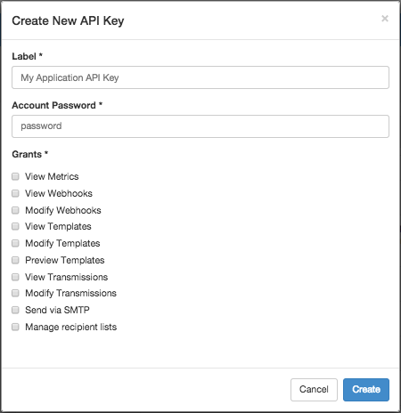

Logged in as: OmniTI, Inc.  ([logout](https://support.messagesystems.com/logout.php))

 

*   [Changelog](https://support.messagesystems.com/start.php?show=changelog)
*   [Documentation](https://support.messagesystems.com/docs/)
*   [Downloads](https://support.messagesystems.com/start.php)

*   [Licenses](https://support.messagesystems.com/license_summary.php)
*   <a href="">Clients</a>
    *   [Support](https://support.messagesystems.com/cs.php)
    *   [Add/Edit](https://support.messagesystems.com/edit_client.php)
    *   [Legal/Products](https://support.messagesystems.com/edit_products.php)
*   [Users](https://support.messagesystems.com/edit_customer.php)

## Search Help

Search for a single word or perform multi-word searches by enclosing your search in quotation marks.

Where you have multiple words but no quotation marks, an **OR** search is performed. For example, **"REST Injection"** searches for the phrase **"REST Injection"**, and, without quotation marks, searches for **REST OR Injection**--the operator is understood.

### Warning

You must escape the following special characters: **+ - && || ! ( ) { } [ ] ^ " ~ * ? : \**. Use the **\** character as the escape character. For example: **B0/00-11719-46C328D4\:default\:**

You can also perform **AND** searches, for example, **rest AND port** (no quotation marks) finds pages where both these words occur.

Terms used in searches are case-insensitive but operators are not. Alphabetic operators **must** be in uppercase.

Other operators can also be used. For more information see "[Query Parser Syntax](https://lucene.apache.org/core/old_versioned_docs/versions/3_0_0/queryparsersyntax.html)". Use of fields in searches is not currently supported.

| Chapter 43. Creating an API Key |
| [Prev](p.http_rest.php)  | Part VII. Message Generation (HTTP) |  [Next](web-ui.apikeys.php) |

## Chapter 43. Creating an API Key

**Configuration Change. ** As of version 4.1, API authentication is enabled by default. For instructions to disable it, see [Chapter 21, *Enforcing REST API/UI User Authentication*](auth.php "Chapter 21. Enforcing REST API/UI User Authentication") . When disabled, an apikey and `Authorization` header is no longer required.

**Introduction**

Momentum offers a set of REST API enabling client applications to integrate with Momentum and perform actions associated with generating messages and reporting analytics data. To ensure security for your application, Momentum enforces API authentication by default. All REST APIs require that you authenticate with every request by specifying an `Authorization` header. The value of the `Authorization` header must be a valid API key with the appropriate permissions to use the API. For examples of supplying the `Authorization` header, refer to the cURL examples in the following sections or any of the individual REST API request examples in the [Momentum 4 REST API](https://support.messagesystems.com/docs/web-rest/v1_index.html) documentation.

If you are the system administrator, you can generate an API key using the web-based UI.

**Creating an API Key** 

This section provides instructions to create an API key in the UI. Take care to record and safeguard your API keys at all times. You cannot retrieve an API key after it has been created.

### Note

For this tutorial, you will need a web browser to access the UI. The UI supports Firefox and Internet Explorer, version 9 and 10. All browsers must have cookies and JavaScript enabled.

You must also have system administration privileges.

Follow these steps to create an API key:

1.  Open the UI by pointing your web browser at the appropriate IP address and log in using your administrator credentials.

2.  Click *`admin`* in the upper-right corner, as shown in [Figure 43.1, “Login”](create_apikey.php#figure_admin_icon "Figure 43.1. Login"), to open the Settings section.

    

    **Figure 43.1. Login**

    

3.  In the Settings section, click the New API Key icon in the upper-right corner to open the Create New API Key form, as shown in [Figure 43.2, “Create New API Key”](create_apikey.php#figure_create_api_key "Figure 43.2. Create New API Key").

    

    **Figure 43.2. Create New API Key**

    

4.  Enter the following information:

    *   Label - User-friendly label for the API key

    *   Account Password - Password for account to verify access

        Your password is required to securely authorize this addition to your account.

5.  Select the grant types that you want from the list displayed. It is always best practice to ONLY select the permissions that are necessary. To complete the examples in the following sections, you will need all grant types. For an explanation of the permissions, see [Section 44.1, “Viewing Your API Keys”](web-ui.apikeys.php#web-ui.apikeys.viewing "44.1. Viewing Your API Keys").

6.  When complete, click Create to create your new API key. If the API key is successfully created, a message will display upon return to the Settings section showing the value of the API key.

7.  Record the value of your API key to use in the following tutorials.

    ### Note

    Be sure to copy and paste the API key when it is displayed. Following the creation of an API key, you can modify its grants and associated label, but the UI will no longer expose the original value. Please take care to record and safeguard your API keys at all times.

Congratulations! You have successfully created an API key using Momentum's UI. In addition to the creating an API key, you can manage your existing API keys using the UI. For more information, see [Chapter 44, *Managing Your API Keys*](web-ui.apikeys.php "Chapter 44. Managing Your API Keys") .

| [Prev](p.http_rest.php)  | [Up](p.http_rest.php) |  [Next](web-ui.apikeys.php) |
| Part VII. Message Generation (HTTP)  | [Table of Contents](index.php) |  Chapter 44. Managing Your API Keys |

Follow us on:

  