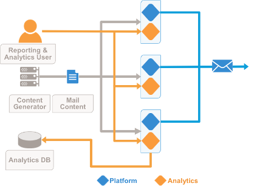

| 5.2. Configuration Options |
| [Prev](hardware.requirements.php)  | Chapter 5. Hardware Considerations |  [Next](hardware.scaling.php) |

## 5.2. Configuration Options

Momentum enables you to create standardized cluster configurations with hardware specifications appropriate for different levels of messaging capacity. You can deploy Momentum in mulitple configurations to meet specific performance and operational requirements. Consult with your Message Systems account team to address requirements not covered here.

### 

**Figure 5.1. Configuration Options**

| [Prev](hardware.requirements.php)  | [Up](hardware.requirements.php) |  [Next](hardware.scaling.php) |
| Chapter 5. Hardware Considerations  | [Table of Contents](index.php) |  5.3. Hardware Scaling Approach |

Follow us on:

  