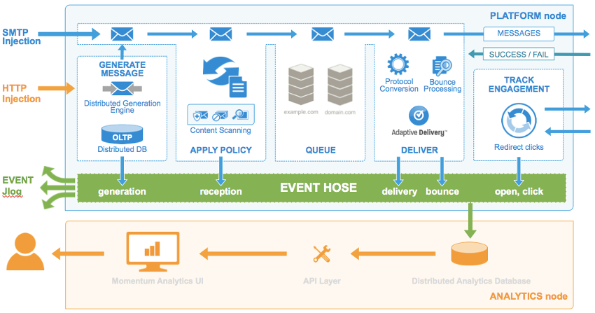

Logged in as: OmniTI, Inc.  ([logout](https://support.messagesystems.com/logout.php))

 

*   [Changelog](https://support.messagesystems.com/start.php?show=changelog)
*   [Documentation](https://support.messagesystems.com/docs/)
*   [Downloads](https://support.messagesystems.com/start.php)

*   [Licenses](https://support.messagesystems.com/license_summary.php)
*   <a href="">Clients</a>
    *   [Support](https://support.messagesystems.com/cs.php)
    *   [Add/Edit](https://support.messagesystems.com/edit_client.php)
    *   [Legal/Products](https://support.messagesystems.com/edit_products.php)
*   [Users](https://support.messagesystems.com/edit_customer.php)

## Search Help

Search for a single word or perform multi-word searches by enclosing your search in quotation marks.

Where you have multiple words but no quotation marks, an **OR** search is performed. For example, **"REST Injection"** searches for the phrase **"REST Injection"**, and, without quotation marks, searches for **REST OR Injection**--the operator is understood.

### Warning

You must escape the following special characters: **+ - && || ! ( ) { } [ ] ^ " ~ * ? : \**. Use the **\** character as the escape character. For example: **B0/00-11719-46C328D4\:default\:**

You can also perform **AND** searches, for example, **rest AND port** (no quotation marks) finds pages where both these words occur.

Terms used in searches are case-insensitive but operators are not. Alphabetic operators **must** be in uppercase.

Other operators can also be used. For more information see "[Query Parser Syntax](https://lucene.apache.org/core/old_versioned_docs/versions/3_0_0/queryparsersyntax.html)". Use of fields in searches is not currently supported.

| Chapter 2. Life of A Message |
| [Prev](components.php)  | Part I. Introduction to Momentum |  [Next](roles_behaviors.php) |

## Chapter 2. Life of A Message

## Inject SMTP Messages or Transmissions

Messages are injected into Momentum 4.x either through SMTP or HTTP. SMTP injection requires you to have a fully-formed message available for injection. HTTP injection uses a transmission JSON object submitted through Momentum via the Transmissions API. Transmissions specify a content template and a list of recipients, both of which may be previously stored or explicitly included in the transmission.

## 

**Figure 2.1. Life of A Message**

## Generate Message

Momentum will acknowledge that it accepted a transmission submitted via HTTP with an “HTTP 200” response. For transmissions with multiple recipients, message generation (that is, a mail merge) is performed after the submission. During the mail merge, Momentum will generate messages that include personalized substitution data on a per-recipient basis.

For single recipient transmissions, the message is generated within the HTTP request (default behavior). If an individual recipient’s message fails during message generation, Momentum reports the failure via the Event Hose.

## Apply Policy

Messages injected over SMTP or generated by Momentum pass through policy phases (or hook points) such as `set_binding`, `final_validation`, etc. Momentum then assigns the message to a binding (i.e., an outgoing IP address used to send a message). Once the message is accepted via SMTP or generated following a transmission submission, Momentum writes it to disk (in the `/var/spool/ecelerity` directory). If the message does not pass the validation checks, it is rejected due to policy.

### Note

The message will still remain in memory; it is only written to disk as a backup in case of a failure or significant delay issues.

## Queue

Momentum adds messages to the binding/domain active queues. Every active binding on the Momentum servers and every domain (which will receive the message) create an active queue. For example, if there are 20 IPs sending to 100 domains, then there would be 2,000 active queues.

## Delivery

Messages in the active queue will try to communicate with the recipient domains. Each active queue will connect to the remote host for delivery of the message.

Adaptive Delivery monitors everything associated with attempts to deliver the message, evaluates feedback, and makes adjustments to the traffic shaping options in the active queues to ensure the messages are delivered.

*   Negative feedback will cause traffic shaping options to be adjusted for fewer connections and fewer messages being sent.

*   No negative feedback will result in adjustments for increased connections and more messages being sent.

The ISP sends a “250 OK” after the messages have been accepted for delivery.

## Engagement Tracking

Momentum uses Engagement Tracking to track opens and clicks. This activity occurs on the Platform node. Opens and clicks for the campaign can then be monitored and reviewed via the web-based UI, Metrics API, and Webhooks API.

## Reporting

The event hose reports all aspects of the message disposition to the Analytics database, including any messages generated via HTTP injection.

| [Prev](components.php)  | [Up](p.intro.php) |  [Next](roles_behaviors.php) |
| Chapter 1. Components  | [Table of Contents](index.php) |  Chapter 3. Roles and Behaviors |

Follow us on:

  