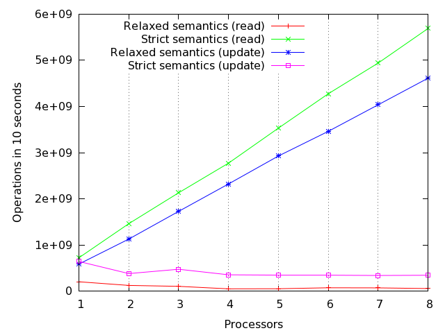

Logged in as: OmniTI, Inc.  ([logout](https://support.messagesystems.com/logout.php))

[](https://support.messagesystems.com/start.php) 

*   [Changelog](https://support.messagesystems.com/start.php?show=changelog)
*   [Documentation](https://support.messagesystems.com/docs/)
*   [Downloads](https://support.messagesystems.com/start.php)

*   [Licenses](https://support.messagesystems.com/license_summary.php)
*   <a href="">Clients</a>
    *   [Support](https://support.messagesystems.com/cs.php)
    *   [Add/Edit](https://support.messagesystems.com/edit_client.php)
    *   [Legal/Products](https://support.messagesystems.com/edit_products.php)
*   [Users](https://support.messagesystems.com/edit_customer.php)

## Search Help

Search for a single word or perform multi-word searches by enclosing your search in quotation marks.

Where you have multiple words but no quotation marks, an **OR** search is performed. For example, **"REST Injection"** searches for the phrase **"REST Injection"**, and, without quotation marks, searches for **REST OR Injection**--the operator is understood.

### Warning

You must escape the following special characters: **+ - && || ! ( ) { } [ ] ^ " ~ * ? : \**. Use the **\** character as the escape character. For example: **B0/00-11719-46C328D4\:default\:**

You can also perform **AND** searches, for example, **rest AND port** (no quotation marks) finds pages where both these words occur.

Terms used in searches are case-insensitive but operators are not. Alphabetic operators **must** be in uppercase.

Other operators can also be used. For more information see "[Query Parser Syntax](https://lucene.apache.org/core/old_versioned_docs/versions/3_0_0/queryparsersyntax.html)". Use of fields in searches is not currently supported.

| msys.counter.open |
| [Prev](lua.ref.msys.counter.inc.php)  | Chapter 70. Lua Functions Reference |  [Next](lua.ref.msys.counter.read.php) |

<a name="lua.ref.msys.counter.open"></a>
## Name

msys.counter.open — Create a counter object

<a name="idp17815792"></a>
## Synopsis

`msys.counter.open(counter_path, semantics);`

```
counter_path: string
semantics: number, optional
```
<a name="idp17818816"></a>
## Description

For performance it is always recommended that counter handles be used rather than strings.

Momentum generic counters are scalable low latency counters that are identified by a unique path in a counter namespace. This namespace may be exported to other facilities for visualization, analysis and more. The namespace hierarchy is defined as follows.

*   `/` – reserved for Message Systems use.

*   `/vendor/<name>` – reserved for vendors. For example, vendor `Foo` may reserve `/vendor/foo`.

*   `/site/<name>` – reserved for clients. For example, client `CompanyA` may use `/site/companya`.

Lua counters are integrated into this system. Counters may be opened with either `msys.counter.STRICT` or `msys.counter.RELAXED` semantics. Strict semantics mean all counter handles will update the same value in memory. Relaxed means all counter handles update their own values in memory. Those values are then aggregated when someone does a read operation on the counter.

If a counter value is updated mostly in a single thread on one processor then the STRICT semantics are recommended. Also, for for policy-level logic, STRICT semantics are recommended as the counters may later be augmented to support atomic fetch and phi operations. If a counter is often updated across different threads or processors then RELAXED semantics are recommended. STRICT semantics provide almost perfect read scalability and RELAXED semantics provide almost perfect update scalability. For a graphic representation see below:

<a name="fig.console_command.counter"></a>

**Figure 70.1. Counter semantics**



**Note about [Figure 70.1, “Counter semantics”](lua.ref.msys.counter.open.php#fig.console_command.counter "Figure 70.1. Counter semantics"). ** In this figure `update` refers to increment and add operations. The sample machine used two Intel® Xeon® CPU E5530 at 2.4GHz with four cores each.

For a code example see [Example 70.54, “msys.counter.read example”](lua.ref.msys.counter.read.php#lua.ref.msys.counter.read.example "Example 70.54. msys.counter.read example").

Enable this function with the statement `require('msys.counter');`.

<a name="idp17840368"></a>
## See Also

[msys.counter.reset](lua.ref.msys.counter.reset.php "msys.counter.reset"), [msys.counter.add](lua.ref.msys.counter.add.php "msys.counter.add"), [msys.counter.inc](lua.ref.msys.counter.inc.php "msys.counter.inc"), [msys.counter.unlink](lua.ref.msys.counter.unlink.php "msys.counter.unlink")

| [Prev](lua.ref.msys.counter.inc.php)  | [Up](lua.function.details.php) |  [Next](lua.ref.msys.counter.read.php) |
| msys.counter.inc  | [Table of Contents](index.php) |  msys.counter.read |

Follow us on:

[](http://www.facebook.com/messagesystems) [](http://twitter.com/#!/MessageSystems) [](http://www.linkedin.com/company/message-systems)