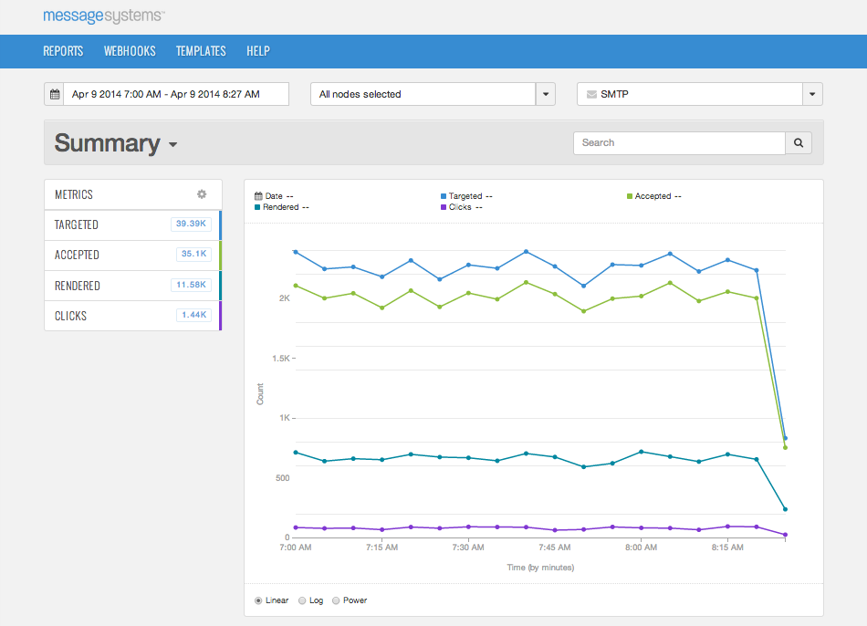
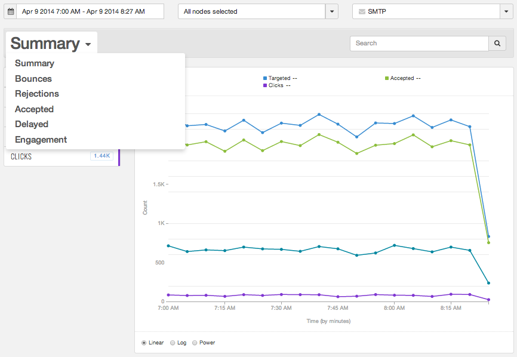

Logged in as: OmniTI, Inc.  ([logout](https://support.messagesystems.com/logout.php))

 

*   [Changelog](https://support.messagesystems.com/start.php?show=changelog)
*   [Documentation](https://support.messagesystems.com/docs/)
*   [Downloads](https://support.messagesystems.com/start.php)

*   [Licenses](https://support.messagesystems.com/license_summary.php)
*   <a href="">Clients</a>
    *   [Support](https://support.messagesystems.com/cs.php)
    *   [Add/Edit](https://support.messagesystems.com/edit_client.php)
    *   [Legal/Products](https://support.messagesystems.com/edit_products.php)
*   [Users](https://support.messagesystems.com/edit_customer.php)

## Search Help

Search for a single word or perform multi-word searches by enclosing your search in quotation marks.

Where you have multiple words but no quotation marks, an **OR** search is performed. For example, **"REST Injection"** searches for the phrase **"REST Injection"**, and, without quotation marks, searches for **REST OR Injection**--the operator is understood.

### Warning

You must escape the following special characters: **+ - && || ! ( ) { } [ ] ^ " ~ * ? : \**. Use the **\** character as the escape character. For example: **B0/00-11719-46C328D4\:default\:**

You can also perform **AND** searches, for example, **rest AND port** (no quotation marks) finds pages where both these words occur.

Terms used in searches are case-insensitive but operators are not. Alphabetic operators **must** be in uppercase.

Other operators can also be used. For more information see "[Query Parser Syntax](https://lucene.apache.org/core/old_versioned_docs/versions/3_0_0/queryparsersyntax.html)". Use of fields in searches is not currently supported.

| Chapter 56. Using the UI for Reporting |
| [Prev](web-ui.php)  | Part VIII. Reporting and Engagement Tracking |  [Next](web-ui.reports.php) |

## Chapter 56. Using the UI for Reporting

**Introduction**

"How do I know what happened to the email?" This question is just as important as "How do I send email?" To run a successful messaging campaign, you need to know that your messages were successfully injected into the MTA and accepted by the recipient's ISP. If they were not, you need to determine what happened to your messages and retrieve data to analyze and correct these issues. Momentum provides copious amounts of data to answer these questions.

Reporting data is available in a web-based User Interface (UI) or using the REST API. The UI provides a flexible, easy-to-use interface to evaluate your message deliverability and campaign performance. Using the UI, you can select metrics, filter the metric data, and view detailed reports based on your specific needs. Its drill-down capabilities enable you to focus your reporting on the message events and data that are most important to you.

**Reporting Data Using the UI** 

This section provides instructions to view delivery data in the UI. Later tutorials will discuss tracking engagement data and retrieving reporting data using the REST API.

### Note

For this tutorial, you will need a web browser to access the UI. The UI supports Firefox and Internet Explorer, version 9 and 10. All browsers must have cookies and JavaScript enabled.

Follow these steps to view reports in the UI:

Open the UI by pointing your web browser at the appropriate IP address and log in using your credentials. If you do not know the IP address, contact your system administrator. Your UI opens in the Summary section under Reports [Figure 56.1, “User Interface”](reporting_ui.php#figure_summary "Figure 56.1. User Interface").

**Figure 56.1. User Interface**

In the METRICS area of the Summary section, the UI reports how many of your messages were successfully injected into Momentum (Targeted) and accepted by the ISP (Accepted). This data is displayed based on time in the corresponding graph.

The Reports tab consists of six sections. Use the drop-down list shown in [Figure 56.2, “Navigating the UI”](reporting_ui.php#figure_navigation "Figure 56.2. Navigating the UI") to navigate the UI.

**Figure 56.2. Navigating the UI**

To create your custom reports, begin in theSummary section by selecting your metrics and filters. Next, view the summary report provided in the Summary section and the detailed reports provided in the Bounces, Rejections, Accepted, and Delayed sections to evaluate your deliverability and performance. The Engagement section includes a specialized report enabling you to drill down to the level of a link within your campaign.

See [Chapter 57, *Reports and Engagement Tracking in the UI*                                  ](web-ui.reports.php "Chapter 57. Reports and Engagement Tracking in the UI") for detailed information about the six reports including screen captures, descriptions of the various metrics, and instructions to create custom reports.

Congratulations! You have successfully logged into Momentum's UI. You can create custom reports in the UI by selecting the metrics and filters for your specific reporting needs. Become familiar with the UI and explore its capabilities.

| [Prev](web-ui.php)  | [Up](p.analytics.php) |  [Next](web-ui.reports.php) |
| Chapter 55. Getting Started with the Web-based User Interface  | [Table of Contents](index.php) |  Chapter 57. Reports and Engagement Tracking in the UI |

Follow us on:

  