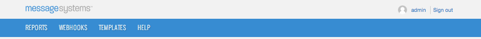
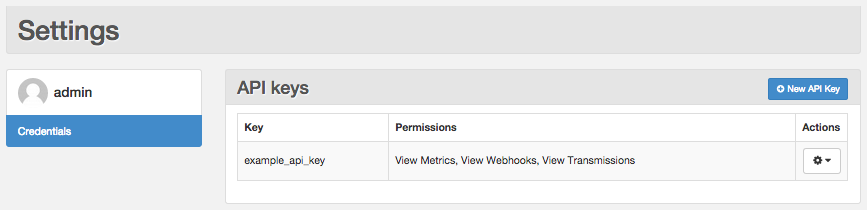

Logged in as: OmniTI, Inc.  ([logout](https://support.messagesystems.com/logout.php))

 

*   [Changelog](https://support.messagesystems.com/start.php?show=changelog)
*   [Documentation](https://support.messagesystems.com/docs/)
*   [Downloads](https://support.messagesystems.com/start.php)

*   [Licenses](https://support.messagesystems.com/license_summary.php)
*   <a href="">Clients</a>
    *   [Support](https://support.messagesystems.com/cs.php)
    *   [Add/Edit](https://support.messagesystems.com/edit_client.php)
    *   [Legal/Products](https://support.messagesystems.com/edit_products.php)
*   [Users](https://support.messagesystems.com/edit_customer.php)

## Search Help

Search for a single word or perform multi-word searches by enclosing your search in quotation marks.

Where you have multiple words but no quotation marks, an **OR** search is performed. For example, **"REST Injection"** searches for the phrase **"REST Injection"**, and, without quotation marks, searches for **REST OR Injection**--the operator is understood.

### Warning

You must escape the following special characters: **+ - && || ! ( ) { } [ ] ^ " ~ * ? : \**. Use the **\** character as the escape character. For example: **B0/00-11719-46C328D4\:default\:**

You can also perform **AND** searches, for example, **rest AND port** (no quotation marks) finds pages where both these words occur.

Terms used in searches are case-insensitive but operators are not. Alphabetic operators **must** be in uppercase.

Other operators can also be used. For more information see "[Query Parser Syntax](https://lucene.apache.org/core/old_versioned_docs/versions/3_0_0/queryparsersyntax.html)". Use of fields in searches is not currently supported.

| Chapter 44. Managing Your API Keys |
| [Prev](create_apikey.php)  | Part VII. Message Generation (HTTP) |  [Next](web-ui.apikeys.create.php) |

## Chapter 44. Managing Your API Keys

**Table of Contents**

<dl class="toc">

<dt>[44.1\. Viewing Your API Keys](web-ui.apikeys.php#web-ui.apikeys.viewing)</dt>

<dt>[44.2\. Creating an API Key](web-ui.apikeys.create.php)</dt>

<dt>[44.3\. Updating an API Key](web-ui.apikeys.update.php)</dt>

<dt>[44.4\. Deleting an API Key](web-ui.apikeys.delete.php)</dt>

</dl>

**Configuration Change. ** As of version 4.1, API authentication is enabled by default. For instructions to disable it, see [Chapter 21, *Enforcing REST API/UI User Authentication*](auth.php "Chapter 21. Enforcing REST API/UI User Authentication") . Version 4.2 and later add View Adaptive Delivery Data grant type.

When API authentication is enabled, all APIs require that you authenticate with every request by providing an `Authorization` header with a value equal to a valid API key. The API key must have the appropriate permissions to use the API. Using the UI, administrators can view details about the existing API keys, create new API keys, update existing API keys, and delete API keys no longer need.

Click *`admin`* in the upper-right corner, as shown in [Figure 44.1, “admin Username”](web-ui.apikeys.php#figure_username_icon "Figure 44.1. admin Username"), to open the Settings section.

**Figure 44.1. admin Username**

## 44.1. Viewing Your API Keys

The Settings section provides a tabular view of your existing API keys, as shown in [Figure 44.2, “API Keys Table”](web-ui.apikeys.php#figure_apikeys_list "Figure 44.2. API Keys Table"). The following information is displayed in the table for each API key:

*   Key - Label specified when you created the API key

*   Permissions - Valid grant types for which the API key will have access

**Figure 44.2. API Keys Table**

API keys can access any resource you give them access to except for the user resources. This restriction is for security reasons. An API key should not be able to modify users. If your key gets loose, this restriction prevents it from being used to gain unfettered access to your system accounts. In [Figure 44.2, “API Keys Table”](web-ui.apikeys.php#figure_apikeys_list "Figure 44.2. API Keys Table"), example_api_key has access to metrics, webhooks, and transmissions.

To create an API key that meets your specific requirements, you must understand the permissions required by each API. [Table 44.1, “Grant Types”](web-ui.apikeys.php#table_grant_types "Table 44.1. Grant Types") gives a mapping of the permissions for a given grant type.

**Table 44.1. Grant Types**

| Grant | Privileges |
| --- | --- |
| View Metrics | GET requests on /api/v1/metrics |
| View Adaptive Delivery Data | GET requests on /api/v1/adaptive-delivery |
| View Webhooks | GET requests on /api/v1/webhooks |
| Modify Webhooks | GET, POST, PUT, DELETE requests on /api/v1/webhooks |
| View Templates | GET requests on /api/v1/templates |
| Modify Templates | GET, POST, PUT, DELETE requests on /api/v1/templates |
| Preview Templates | POST requests on /api/v1/templates |
| View Transmissions | GET requests on /api/v1/transmissions |
| Modify Transmissions | GET, POST, PUT, DELETE requests on /api/v1/transmissions |
| Send via SMTP | Allow this API Key to perform SMTP injection (Note that your configuration must support SMTP authorization.) |
| Manage recipient lists | GET, POST, PUT, DELETE requests on /api/v1/recipient-lists |

| [Prev](create_apikey.php)  | [Up](p.http_rest.php) |  [Next](web-ui.apikeys.create.php) |
| Chapter 43. Creating an API Key  | [Table of Contents](index.php) |  44.2. Creating an API Key |

Follow us on:

  