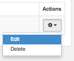
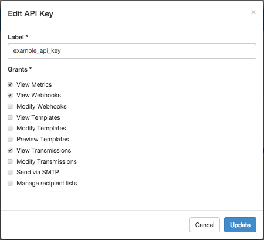

Logged in as: OmniTI, Inc.  ([logout](https://support.messagesystems.com/logout.php))

 

*   [Changelog](https://support.messagesystems.com/start.php?show=changelog)
*   [Documentation](https://support.messagesystems.com/docs/)
*   [Downloads](https://support.messagesystems.com/start.php)

*   [Licenses](https://support.messagesystems.com/license_summary.php)
*   <a href="">Clients</a>
    *   [Support](https://support.messagesystems.com/cs.php)
    *   [Add/Edit](https://support.messagesystems.com/edit_client.php)
    *   [Legal/Products](https://support.messagesystems.com/edit_products.php)
*   [Users](https://support.messagesystems.com/edit_customer.php)

## Search Help

Search for a single word or perform multi-word searches by enclosing your search in quotation marks.

Where you have multiple words but no quotation marks, an **OR** search is performed. For example, **"REST Injection"** searches for the phrase **"REST Injection"**, and, without quotation marks, searches for **REST OR Injection**--the operator is understood.

### Warning

You must escape the following special characters: **+ - && || ! ( ) { } [ ] ^ " ~ * ? : \**. Use the **\** character as the escape character. For example: **B0/00-11719-46C328D4\:default\:**

You can also perform **AND** searches, for example, **rest AND port** (no quotation marks) finds pages where both these words occur.

Terms used in searches are case-insensitive but operators are not. Alphabetic operators **must** be in uppercase.

Other operators can also be used. For more information see "[Query Parser Syntax](https://lucene.apache.org/core/old_versioned_docs/versions/3_0_0/queryparsersyntax.html)". Use of fields in searches is not currently supported.

| 44.3. Updating an API Key |
| [Prev](web-ui.apikeys.create.php)  | Chapter 44. Managing Your API Keys |  [Next](web-ui.apikeys.delete.php) |

## 44.3. Updating an API Key

You can edit the label and grants of an existing API key. From the Settings section, click the icon to the right of the API key that you want to update. In the list, click Edit, as shown in [Figure 44.4, “Update API Key”](web-ui.apikeys.update.php#figure_update_apikey "Figure 44.4. Update API Key").

**Figure 44.4. Update API Key**

Make your changes in the Edit API Key form, as shown in [Figure 44.5, “Edit API Key”](web-ui.apikeys.update.php#figure_edit_apikey "Figure 44.5. Edit API Key"), and then click Update.

**Figure 44.5. Edit API Key**

If the API key successfully updates, a message will display upon return to the Settings section. Click the x to close the message.

| [Prev](web-ui.apikeys.create.php)  | [Up](web-ui.apikeys.php) |  [Next](web-ui.apikeys.delete.php) |
| 44.2. Creating an API Key  | [Table of Contents](index.php) |  44.4. Deleting an API Key |

Follow us on:

  