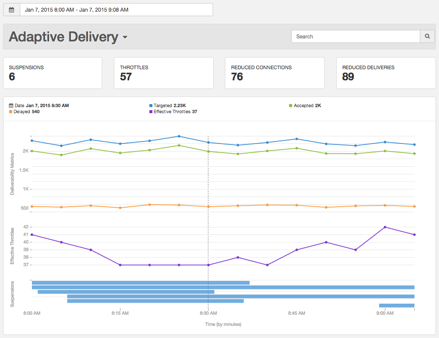
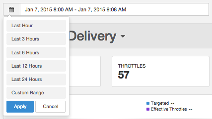
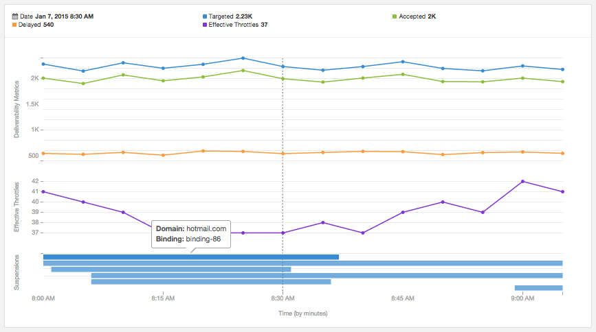
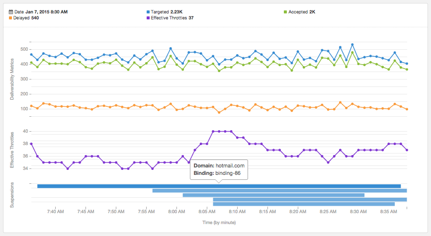
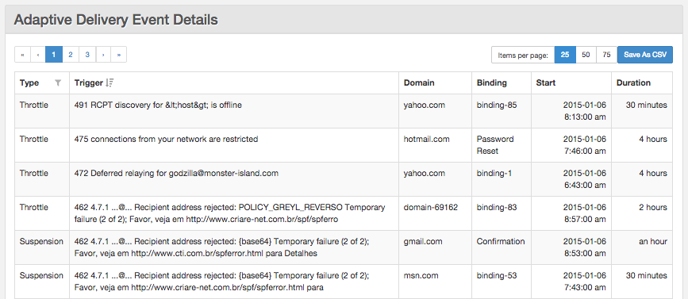

Logged in as: OmniTI, Inc.  ([logout](https://support.messagesystems.com/logout.php))

 

*   [Changelog](https://support.messagesystems.com/start.php?show=changelog)
*   [Documentation](https://support.messagesystems.com/docs/)
*   [Downloads](https://support.messagesystems.com/start.php)

*   [Licenses](https://support.messagesystems.com/license_summary.php)
*   <a href="">Clients</a>
    *   [Support](https://support.messagesystems.com/cs.php)
    *   [Add/Edit](https://support.messagesystems.com/edit_client.php)
    *   [Legal/Products](https://support.messagesystems.com/edit_products.php)
*   [Users](https://support.messagesystems.com/edit_customer.php)

## Search Help

Search for a single word or perform multi-word searches by enclosing your search in quotation marks.

Where you have multiple words but no quotation marks, an **OR** search is performed. For example, **"REST Injection"** searches for the phrase **"REST Injection"**, and, without quotation marks, searches for **REST OR Injection**--the operator is understood.

### Warning

You must escape the following special characters: **+ - && || ! ( ) { } [ ] ^ " ~ * ? : \**. Use the **\** character as the escape character. For example: **B0/00-11719-46C328D4\:default\:**

You can also perform **AND** searches, for example, **rest AND port** (no quotation marks) finds pages where both these words occur.

Terms used in searches are case-insensitive but operators are not. Alphabetic operators **must** be in uppercase.

Other operators can also be used. For more information see "[Query Parser Syntax](https://lucene.apache.org/core/old_versioned_docs/versions/3_0_0/queryparsersyntax.html)". Use of fields in searches is not currently supported.

| 57.3. Adaptive Delivery Report |
| [Prev](web-ui.reports.viewing.reports.php)  | Chapter 57. Reports and Engagement Tracking in the UI |  [Next](web-ui.reports.evaluating.campaign.performance.php) |

## 57.3. Adaptive Delivery Report

Adaptive Delivery® auto-tunes your outbound email delivery parameters and traffic shaping in real-time to avoid blocks, to safeguard your reputation, and to optimize delivery. Adaptive delivery events occur when an adaptive rule is triggered or as a result of automatic performance tuning. For details about Momentum's Adaptive Delivery® feature, see [Adaptive Delivery User Guide](https://support.messagesystems.com/docs/web-ad/index.php). The Adaptive Delivery report in the UI enables you to view details about adaptive delivery events when they occur and to relate these events to deliverability metrics that may be impacted by them.

### Note

Navigating to the Adaptive Delivery report removes all filters except time period, binding, and domain.

[Figure 57.16, “Adaptive Delivery Report”](web-ui.reports.adaptive.delivery.php#figure_adaptive_report "Figure 57.16. Adaptive Delivery Report") shows an example report.

**Figure 57.16. Adaptive Delivery Report**

The following are the metrics displayed in the upper area of this report:

*   Suspensions - Number of suspensions on outgoing messages for a given domain and binding

*   Throttles - Number of times Momentum limited the rate of outgoing messages

*   Reduced Connections - Number of connections Momentum reduced in response to an adaptive rule trigger

*   Reduced Deliveries - Number of deliveries Momentum reduced in response to an adaptive rule trigger

### 57.3.1. Time Period

The Adaptive Delivery report provides access to the most recent week's worth of data, which is a shorter time period than provided by the other reports. [Figure 57.17, “Time Period Drop-down List”](web-ui.reports.adaptive.delivery.php#figure_adaptive_time "Figure 57.17. Time Period Drop-down List") shows the pre-set time periods available in this report. By default, the UI displays data for the Last Hour pre-set.

### Note

If you need to capture adaptive delivery data over time ranges longer than one week, create a webhook for Adaptive Delivery events. For information about webhooks, see [Chapter 60, *Managing Your Webhooks in the UI*](web-ui.webhooks.php "Chapter 60. Managing Your Webhooks in the UI") 

**Figure 57.17. Time Period Drop-down List**

For information about selecting the time period filter, see [Section 57.1.3.1, “Time Period”](web-ui.reports.php#web-ui.reports.select.time "57.1.3.1. Time Period").

### 57.3.2. Analyzing Adaptive Delivery Events

The graph in the Adaptive Delivery report displays the effective throttles and suspensions along with relative deliverability metrics, enabling you to see how the individual adaptive event effects the message activity. The graph uses a different color for each metric with the color corresponding to the legend above the graph. The precision of the graph changes based on the time period selected. In [Figure 57.18, “Adaptive Delivery Graph”](web-ui.reports.adaptive.delivery.php#figure_suspension_detail "Figure 57.18. Adaptive Delivery Graph"), the time period is Last Hour. Note that the units on the x-axis are by minutes.

To view the values of the deliverability metrics and effective throttles at a specific time, hover over the line graph. The values are displayed in the legend above the graph. This feature enables you to see the relationship of the selected metrics as a function of time.

Suspensions are displayed by Gantt Bars representing the timespan of the event. To view the value of a suspension for a specific domain and binding, hover over the Gantt Bar, as shown in [Figure 57.18, “Adaptive Delivery Graph”](web-ui.reports.adaptive.delivery.php#figure_suspension_detail "Figure 57.18. Adaptive Delivery Graph").

**Figure 57.18. Adaptive Delivery Graph**

To view an expanded graph for a given suspension timespan, click the Gantt Bar for the suspension. [Figure 57.19, “Expanded View”](web-ui.reports.adaptive.delivery.php#figure_suspension_detailed "Figure 57.19. Expanded View") shows an expanded view of the timespan for the example suspension on hotmail.com/binding-86\. Note that the x-axis of the graph spans the time of the selected suspension, allowing you to view a finer precision of the other metrics during the duration of the suspension.

**Figure 57.19. Expanded View**

### 57.3.3. Viewing Adaptive Delivery Event Details

The table provided in the lower area of the Adaptive Report lists details related to a specific adaptive delivery event. [Figure 57.20, “Adaptive Delivery Table”](web-ui.reports.adaptive.delivery.php#figure_adaptive_details "Figure 57.20. Adaptive Delivery Table") shows an example.

**Figure 57.20. Adaptive Delivery Table**

The following are the columns in the table:

*   Type - Type of adaptive event (throttle or suspension)

*   Trigger - Response from the ISP that triggered the adaptive rule

*   Domain - Parent domain of whatever domain triggered the adaptive event

*   Binding - Binding on which the adaptive event was triggered

*   Start - Start timestamp of the adaptive event

*   Duration - Duration of the adaptive event

You can filter the data further by Type to narrow the scope of your report. Click the filter icon in the Type column to select Throttle or Suspension from the drop-down list. Sort the table by any column to show different arrangements. For example, filter by Throttle for Type, and then sort in descending order by Trigger. The resulting table displays the reasons why messages were throttled in descending order of trigger code.

| [Prev](web-ui.reports.viewing.reports.php)  | [Up](web-ui.reports.php) |  [Next](web-ui.reports.evaluating.campaign.performance.php) |
| 57.2. Viewing Your Reports  | [Table of Contents](index.php) |  57.4. Evaluating Your Campaign Performance |

Follow us on:

  