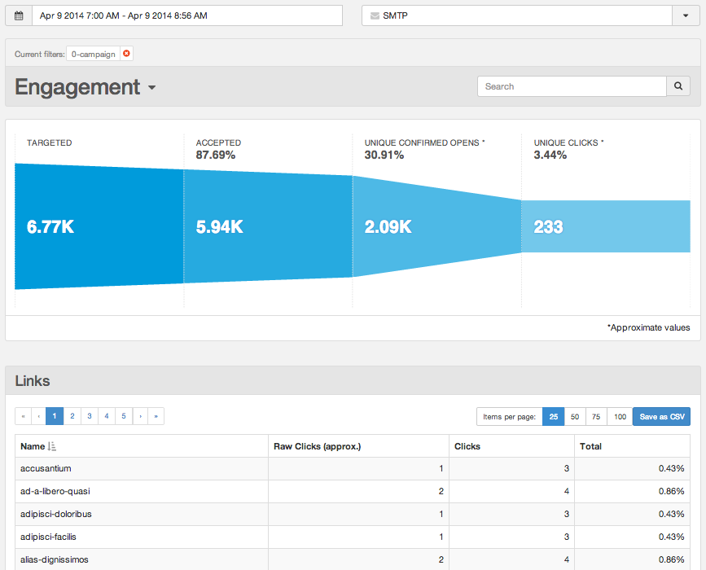

## 57.4. Evaluating Your Campaign Performance

Knowing how many of your messages were opened and what links within the messages were selected are critical pieces in evaluating your campaign's success. The UI provides this engagement data in one specialized report. Use this Engagement report to view details about the performance of your messages and links.

### 57.4.1. Engagement Report

The Engagement report is specially designed to enable you to drill down to the level of a link within your message. The only applicable filters for this report are time period and campaign in 4.2, domain, and template --> . To select these filters, go to the Summary section, select your time period, and then filter on your campaign and/or domain and/or template either by selecting the name in the table or by entering it in the Search box. Next, go to the Engagement section.

### Note

Navigating to the Engagement section removes all filters except time period and campaign. Navigating to the Engagement section removes the binding, binding group, and node filters.

[Figure 57.21, “Engagement Report”](web-ui.reports.evaluating.campaign.performance.php#figure_engagement_report "Figure 57.21. Engagement Report") shows an example report with filters for domain and campaign. [Figure 57.21, “Engagement Report”](web-ui.reports.evaluating.campaign.performance.php#figure_engagement_report "Figure 57.21. Engagement Report") shows an example report with a filter for campaign.

**Figure 57.21. Engagement Report**

**57.4.1.1. Viewing Performance**

The Engagement report includes a graph showing the progress of your campaign’s performance, as shown in [Figure 57.21, “Engagement Report”](web-ui.reports.evaluating.campaign.performance.php#figure_engagement_report "Figure 57.21. Engagement Report"). The following metrics are displayed in the graph:

*   Targeted - Messages successfully injected into Momentum, as well as rejected by it

*   Accepted - Messages an ISP or other remote domain accepted, less Out-of-Band Bounces

*   Unique Confirmed Opens - Approximation (+/- 5%) of the total number of messages that were either rendered or had at least one link selected

*   Unique Clicks - Approximation (+/- 5%) of the total number of messages that had at least one link selected one or more times

From the graph, you can quickly determine what percentage of your messages have been accepted, are being opened, and have had a link selected.

### Note

For an explanation of the approximate values, see [Section 57.1.1, “Selecting Metrics”](web-ui.reports.php#web-ui.reports.select.metrics "57.1.1. Selecting Metrics").

**57.4.1.2. Identifying Selected Links**

The table included in the lower area of the Engagement report, shown in [Figure 57.21, “Engagement Report”](web-ui.reports.evaluating.campaign.performance.php#figure_engagement_report "Figure 57.21. Engagement Report"), enables you to view how many times a link within your message has been clicked.

The following are the columns in the table:

*   Name - Link within a message. If you did not specify a link name in your stored template or inline template content, the name defaults to Raw URL. For additional information, see the section on *Link Names*       in the Substitution Reference available at [Momentum 4 REST API](https://support.messagesystems.com/docs/web-rest/v1_index.html). -->

*   Raw Clicks (approx.) - Approximation (+/- 5%) of the number of unique clicks for the given link, e.g., Recipient 1 clicks the link one time and recipient 2 clicks the link three times. Raw Clicks equal two.

*   Clicks - Total number of clicks for the given link, including multiple clicks by the same recipient, e.g., for the previous example, Clicks equals four.

*   Total - Total number of clicks for the given link (i.e., Clicks) divided by Total Clicks for the time period and/or campaign filters applied. Note that Total Clicks is not listed in the report.

You can sort the data by any column to show different arrangements. For example, sorting by Clicks in descending order shows the links that had the most clicks.

| [Prev](web-ui.reports.adaptive.delivery.php)  | [Up](web-ui.reports.php) |  [Next](reporting_metrics.php) |
| 57.3. Adaptive Delivery Report  | [Table of Contents](index.php) |  Chapter 58. Using the Metrics API for Reporting |

Follow us on:

  