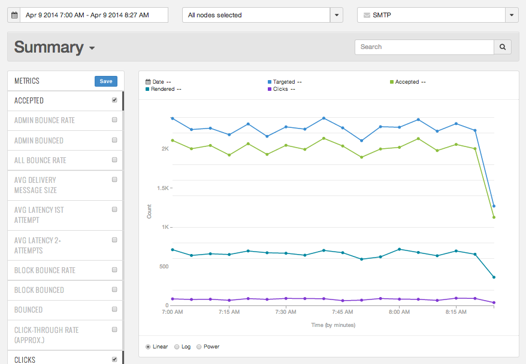
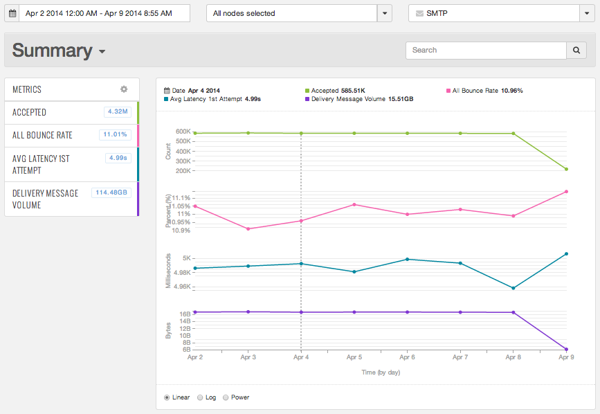
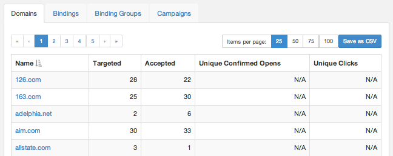
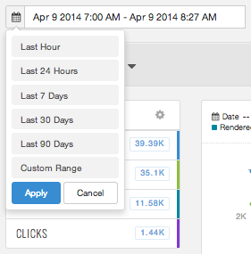
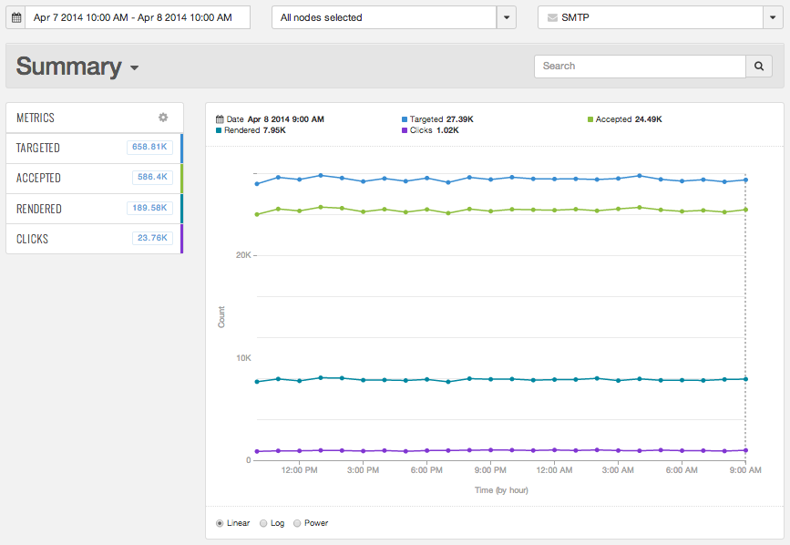
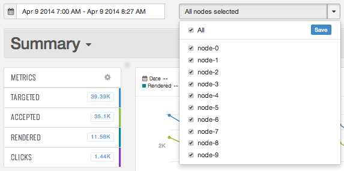

| [Prev](reporting_ui)  | Part VIII. Reporting and Engagement Tracking |  [Next](web-ui.reports.viewing.reports) |
## Chapter 57. Reports and Engagement Tracking in the UI
**Table of Contents**

* [57.1\. Selecting Your Metrics and Filters](web-ui.reports#web-ui.reports.selecting.metrics.filters)
* [57.2\. Viewing Your Reports](web-ui.reports.viewing.reports)
* [57.3\. Adaptive Delivery Report](web-ui.reports.adaptive.delivery)
* [57.4\. Evaluating Your Campaign Performance](web-ui.reports.evaluating.campaign.performance)

**Configuration Change. ** Momentum 4.2 and later adds reporting by template in all reports, filtering by domain in the Engagement report, and an Adaptive Delivery report.
The UI provides a flexible, easy-to-use interface to evaluate your message deliverability and campaign performance. All the metrics provided in the Metrics API are also available in the UI. Using the UI, you can select metrics, filter the metric data, and view detailed reports based on your specific needs. Its drill-down capabilities enable you to focus your reporting on the message events and data that are most important to you.
The Reports tab consists of six sections. To create your custom reports, begin in the Summary section by selecting your metrics and filters. Next, view the summary report provided in the Summary section and the detailed reports provided in the Bounces, Rejections, Accepted, and Delayed sections to evaluate your deliverability and performance. The Engagement section includes a specialized report enabling you to drill down to the level of a link within your campaign, while the Adaptive Delivery section includes a specialized report enabling you to view data related to managing your outbound traffic. Use the drop-down list shown in [Figure 57.1, “Navigating Reports”](web-ui.reports#figure_navigation_menu "Figure 57.1. Navigating Reports") to navigate Reports.

**Figure 57.1. Navigating Reports**

### Note
In order to view any generation or engagement data, you must be licensed for Message Generation Support. If you are not licensed, the UI displays a *0* entry for metrics in these categories.
This version of the UI supports reporting for the SMTP protocol only. SMS and push notifications are not currently tracked.
## 57.1. Selecting Your Metrics and Filters
In the Summary section, you can select metrics and filters enabling you to drill down to the specific data that you need for your reporting. The UI updates only when you select a metric or filter. It does not automatically refresh.
### 57.1.1. Selecting Metrics
From the METRICS drop-down list shown in [Figure 57.2, “Metrics Drop-down List”](web-ui.reports#figure_metrics_list "Figure 57.2. Metrics Drop-down List"), you can select from a comprehensive list of metrics. Click the icon next to METRICS to open the list.
Hover over any metric to display tool-tips providing a description. Then, select the check boxes for the metrics that you want to include in your report. You can select a maximum of five metrics. To save your selections, click Save.

**Figure 57.2. Metrics Drop-down List**

Five of the metrics are approximations (+/- 5%) of the real, distinct counts. Note that the approximation includes (APPROX.) in the name. Using these approximations enables your UI to load faster.
### Note
The UI can be configured to provide the following non-approximated engagement metrics: CLICK-THROUGH RATE, OPEN RATE, UNIQUE CLICKS, UNIQUE CONFIRMED OPENS, or UNIQUE RENDERED. If your reports require these real, distinct counts, contact your technical support representative. Note that using these metrics will increase the response time of the UI.
Selecting the following deliverability metrics will increase the response time of the UI: AVG DELIVERY MESSAGE SIZE, AVG LATENCY 1ST ATTEMPT, AVG LATENCY 2+ ATTEMPTS, DELIVERED 1ST ATTEMPT, or DELIVERED 2+ ATTEMPTS.
### 57.1.2. Viewing Summary Report
The Summary report provides graphical and tabular views of the metric data.
**57.1.2.1. Graphical Display**
In the METRICS area of the Summary report, the totals for the selected metrics are displayed next to the corresponding name. Each metric is displayed as a function of time in the adjacent graph. The graph uses a different color for each metric with the color corresponding to the bar along the right side of the METRICS area and the legend above the graph. The precision of the graph changes based on the time period selected. In [Figure 57.3, “Summary Graph”](web-ui.reports#figure_summary_graph "Figure 57.3. Summary Graph"), the time period is Last 7 Days. Note that the units on the x-axis are by day. For information about selecting the time period filter, see [Section 57.1.3.1, “Time Period”](web-ui.reports#web-ui.reports.select.time "57.1.3.1. Time Period").
There are four possible measurements for the metrics:
*   Count - Number of messages, e.g., Accepted
*   Percent - Rate, e.g., All Bounce Rate
*   Milliseconds - Time latency, e.g., Avg Latency 1st Attempt
*   Bytes - Size of the messages, e.g., Delivery Message Volume
Each measurement is displayed separately, if an applicable metric is selected.

**Figure 57.3. Summary Graph**

To view the values of the metrics at a specific time, hover over the graph. The values are displayed in the legend above the graph. This feature enables you to see the relationship of the selected metrics as a function of time.
By default, the scale of the graph is linear. You can change the scale to log or to power by selecting the corresponding radio button located below the graph.
**57.1.2.2. Table Format**
The tabular view lists the metric totals by domains, bindings, binding groups, campaigns, and templates for the selected time period, as shown in [Figure 57.4, “Summary Table”](web-ui.reports#figure_summary_table "Figure 57.4. Summary Table"). These groupings are organized by tabs in the table.
### Note
Bindings are user-specific, with the exception of the #mmove binding. This binding occurs if you are using DuraVIP™. For details about DuraVIP™, see [Section 27.2, “`duravip_follow` and the #mmove Binding”](cluster.config.mmove "27.2. duravip_follow and the #mmove Binding").
The tabular view includes metric totals for templates that have been deleted, indicated by a label entry of **`deleted`**. These templates are not available in the Search function.
Each tab includes the top 1000 of that grouping with the exception of the Domains tab. By default, the number of domains is reduced to approximately 250\. As you filter the metric data, the number will increase to 1000\. The top 1000 is defined as the 1000 that have the most messages injected into Momentum. This restriction was implemented to allow the UI to load faster. Data is available for all domains, bindings, binding groups, campaigns, and templates. To display any data not shown by default, select applicable filters as described in [Section 57.1.4, “Filtering Metric Data”](web-ui.reports#web-ui.reports.filtering.selected.metrics "57.1.4. Filtering Metric Data").
### Note
Having more than 3000 each of bindings, binding groups, campaigns, and templates is not recommended and may negatively affect performance of the API and UI.

**Figure 57.4. Summary Table**

To navigate through the table, click the tabs. Use the controls located below the tabs to select the page to display and the number of items per page. You can sort by any column in ascending or descending order by clicking the sorting icon in the column header. This icon is visible in the header of the currently sorted column. If the icon is not visible, hover over the name in the header, and the icon will appear.
You can also export data to a CSV file. Click the Save as CSV button to export the data. The export file will include only the data that is available to view in the tab currently selected. You must export each tab separately.
### Note
Internet Explorer, version 9 does not support exporting data to a CSV file. If you need this function, upgrade Internet Explorer or use Firefox.
Note that an entry of *N/A* in the table indicates that the metric does not support the selected filters at this time.
### 57.1.3. Filtering Time Period and Node
The drop-down lists located in the upper area of each web page enable you to filter your reports based on time period and node.
**57.1.3.1. Time Period**
By default, the UI displays data for the Last Hour pre-set. You can select other pre-set time periods or set your own custom range. Click the calendar icon and select from the drop-down list shown in [Figure 57.5, “Time Period Drop-down List”](web-ui.reports#figure_time "Figure 57.5. Time Period Drop-down List"). Selecting a pre-set time period automatically updates the report. To set a custom range, select Custom Range, select your dates and times, and then click Apply to update the report.

**Figure 57.5. Time Period Drop-down List**

In the graph on the Summary report, the precision of the data is based on the time period selected. A data point can represent the total for a minute, five minutes, fifteen minutes, an hour, twelve hours, or a day. As an example of a five minute precision, a data point at 9:00 AM represents data for the time span of 9:00:00 AM - 9:04:59 AM. The x-axis of the graph changes based on the precision. See [Figure 57.3, “Summary Graph”](web-ui.reports#figure_summary_graph "Figure 57.3. Summary Graph") for an example of a day precision.
Reports created with the pre-set time periods display data from the beginning of the selected time period up to the current time. The beginning time is rounded to the earliest hour, while the current time is rounded to the latest minute. The last data point for a pre-set time period may not represent a complete precision interval and should not be used to evaluate your report.
Reports created with a custom range display data from the beginning of the selected time period up to but not including the ending time. In the example shown in [Figure 57.6, “Custom Range”](web-ui.reports#figure_custom_range "Figure 57.6. Custom Range"), a custom range of `Apr 7 2014 10:00 AM - Apr 8 2014 10:00 AM` displays data from Apr 7 2014 10:00:00 AM to Apr 8 2014 9:59:59 AM in one hour increments. The last data point is displayed at 9:00 AM and is the total for the last full hour, i.e., 9:00:00 AM to 9:59:59 AM. In this case, the last point represents a complete data set for the given precision interval.

**Figure 57.6. Custom Range**

**57.1.3.2. Node**
To list your node names, click the arrow as shown in [Figure 57.7, “Node Drop-down List”](web-ui.reports#figure_node "Figure 57.7. Node Drop-down List"). Node names are user-defined and correspond to your Platform nodes. Only nodes that have had message data will appear in the list. Even if a node has been disconnected, it will appear in the list since it still has historical data associated with it. Select the check boxes for the nodes that you want to include in your report and then click Save to save your selections.

**Figure 57.7. Node Drop-down List**

### 57.1.4. Filtering Metric Data
The UI is designed to provide maximum flexibility enabling you to drill down to the events and engagement data that are most important to you. You can filter your selected metrics by any domain, binding, binding group, campaigns, and templates using one of two methods: by the Search function or by table entry.
**57.1.4.1. Filtering by Search**
To filter by the Search function, enter the domain, binding, binding group, campaigns, or templates that you want to include in your report in the Search box. The entry will pre-fill after three letters, as shown in [Figure 57.8, “Filter by Search”](web-ui.reports#figure_filter_by_search "Figure 57.8. Filter by Search"). The table and graph are updated displaying only data for that name. Search only allows one filter at a time and removes any other filters.

**Figure 57.8. Filter by Search**

### Note
Campaign names are submitted when the message is injected into Momentum using the REST API. If you want to filter by campaign, you must know the name that was submitted.
You can search by the template's label or ID. These fields are assigned when the template is created. If you want to filter by template, you must know the label or ID that was assigned. Note that you cannot search by a template that has been deleted.
**57.1.4.2. Filtering by Table Entry**
To filter by table entry, select a tab in the table and click the domain, binding, binding group, campaign, or template that you want to include in your report. The filter is listed in the area below the time period, and the table and graph are updated to display only data for that filter, as shown in [Figure 57.9, “Filter by Table Entry”](web-ui.reports#figure_filter_by_entry "Figure 57.9. Filter by Table Entry"). In this example, the data is filtered by domain. You can drill down multiple levels by consecutively selecting entries, i.e., select a binding, binding group, campaign, or template in any successive order.

**Figure 57.9. Filter by Table Entry**

**57.1.4.3. Removing Filters**
To remove any filter, click the X located to the right of the filter, as shown in [Figure 57.9, “Filter by Table Entry”](web-ui.reports#figure_filter_by_entry "Figure 57.9. Filter by Table Entry").
### Note
Navigating to the Engagement section removes all filters except time period and campaign, if selected. Navigating to the Engagement section removes the binding, binding group, and node filters, if selected.
| [Prev](reporting_ui)  | [Up](p.analytics) |  [Next](web-ui.reports.viewing.reports) |
| Chapter 56. Using the UI for Reporting  | [Table of Contents](index) |  57.2. Viewing Your Reports |
