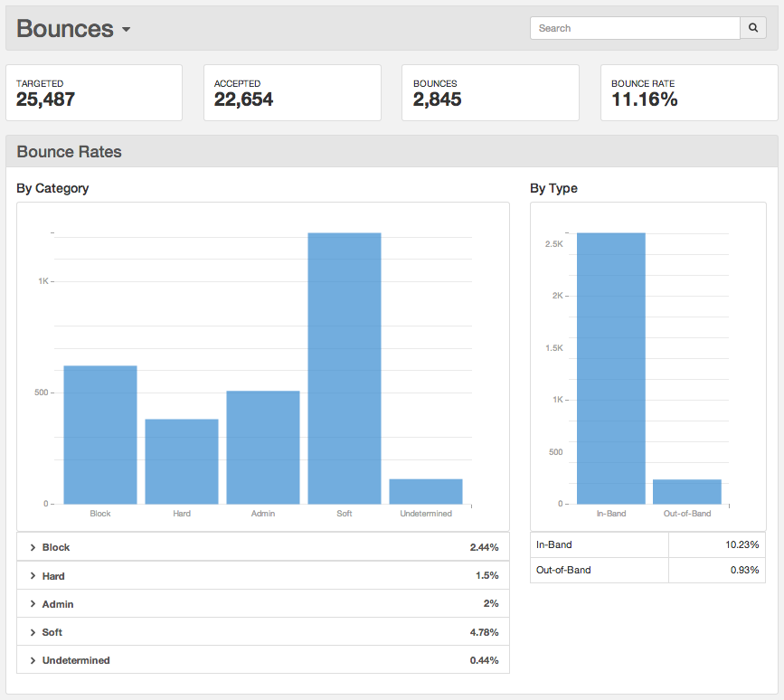
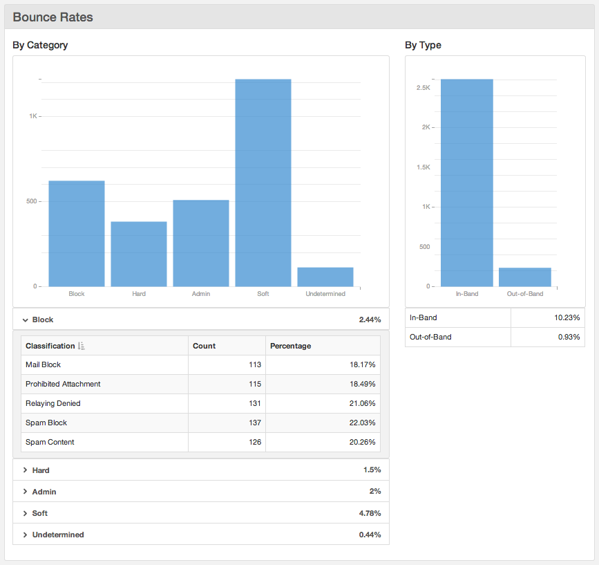
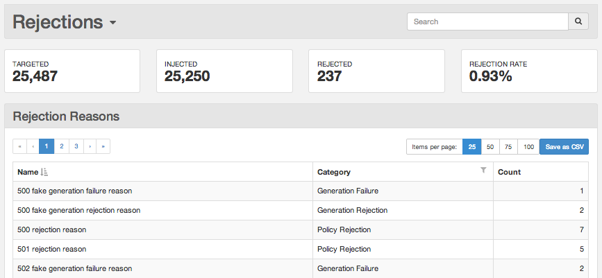
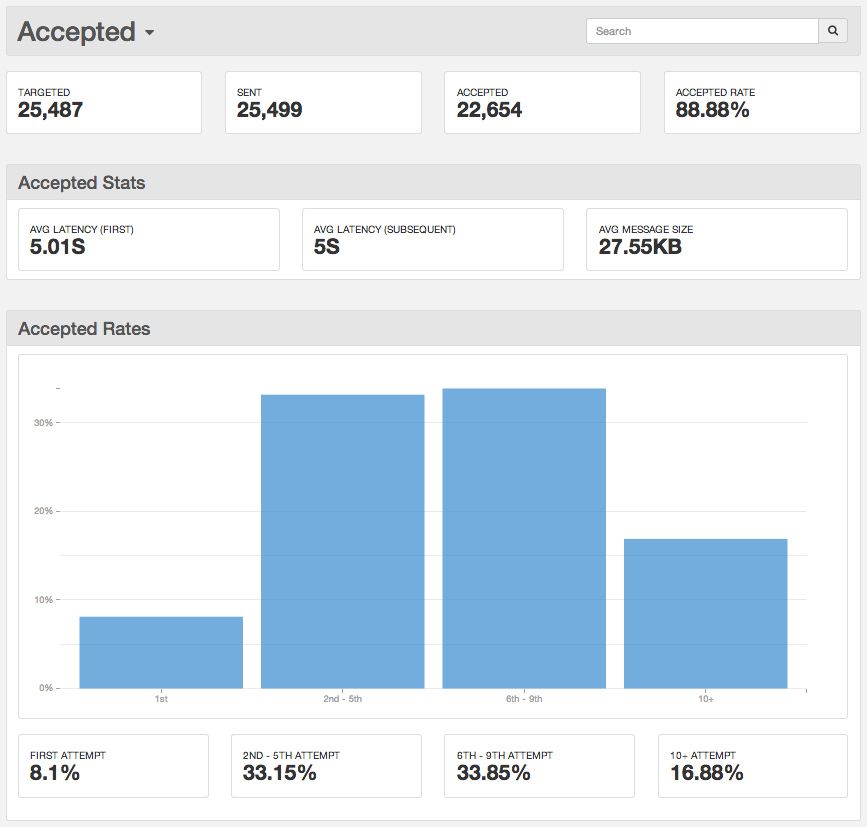
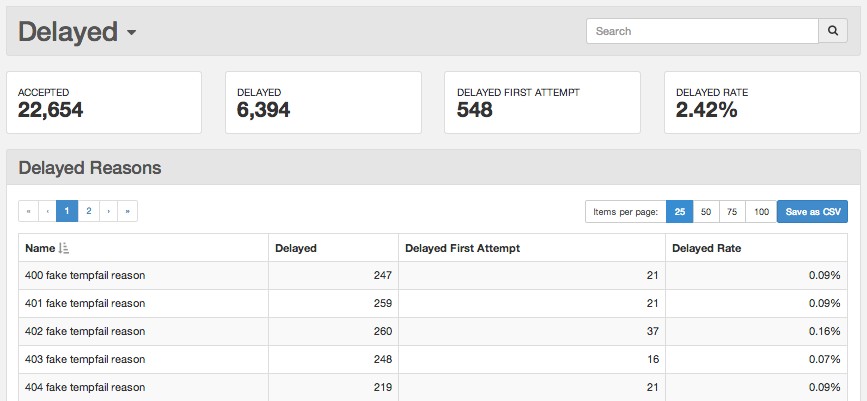

## 57.2. Viewing Your Reports

After you have selected your metrics and filters, view your reports by going to the corresponding sections as described in [Figure 57.1, “Navigating Reports”](web-ui.reports.php#figure_navigation_menu "Figure 57.1. Navigating Reports"). The UI generates all the reports using the filters that you selected in the Summary section with the exception of the Engagement and Adaptive Delivery section. The Engagement section only supports the time period and campaign filters, domain, campaign, and template filters. The Adaptive Delivery section only supports the time period, binding, and domain filters.

### Note

The graphs in the UI depend on your specific messaging solution including the configuration options that you set in the ecelerity.conf file. For example, there will be no entries in the 10+ bar of the graph shown in [Figure 57.14, “Accepted Report”](web-ui.reports.viewing.reports.php#figure_accepted_report "Figure 57.14. Accepted Report") if the `max_retries` option is set for less than ten. For details about Momentum’s configuration options, see [Chapter 66, *Configuration Options Summary*](config.options.summary.php "Chapter 66. Configuration Options Summary") .

All tables included in the reports support exporting the data to a CSV file. Click the Save as CSV button located above each table to export the data. The export file will include only the data that is available to view in the table.

### Note

Internet Explorer, version 9 does not support exporting data to a CSV file. If you need this function, upgrade Internet Explorer or use Firefox.

Use the controls located above the tables to select the page to display and the number of items per page. You can sort by any column in ascending or descending order by clicking the sorting icon in the column header. This icon is visible in the header of the currently sorted column. If the icon is not visible, hover over the name in the header, and the icon will appear.

Note that an entry of *N/A* in a table indicates that the metric does not support the selected filters at this time.

### 57.2.1. Bounces Report

Messages can bounce due to a wide variety of reasons. Some messages are not accepted by the ISP and are returned immediately, while others are accepted but later returned for some reason. The UI provides the Bounces report enabling you to view details about your bounced messages. This report includes bounce rate, bounce rates by category and by type, and reasons why the messages bounced. [Figure 57.10, “Bounces Report”](web-ui.reports.viewing.reports.php#figure_bounces_report "Figure 57.10. Bounces Report") shows an example report.

**Figure 57.10. Bounces Report**

The following are the metrics displayed in the upper area of this report:

*   Targeted - Messages successfully injected into Momentum, as well as rejected by it

*   Accepted - Messages an ISP or other remote domain accepted, less Out-of-Band Bounces

*   Bounces - Total number of bounced messages, which includes both In-Band and Out-of-Band bounces

*   Bounce Rate - Bounces divided by Targeted

Bounce Rate is one indicator of message deliverability. A lower rate shows that more of your messages are reaching the intended recipients.

**57.2.1.1. Analyzing Bounces by Type and by Category**

When a message bounces, the ISP returns a notification that includes a code and explanation of why the message bounced. Using these codes, the UI creates two bar graphs displaying the number of bounced messages by type and by category.

The graph on the right displays the Bounces By Type. In-Band bounces are those messages that are immediately returned by the ISP or other remote domain, while Out-of-Band bounces are those messages that were initially accepted but were returned later. Bounce Rate for each type is listed below the graph. This Bounce Rate is defined as the total number of bounced messages assigned to that type divided by Targeted.

The graph on the left displays Bounces By Category: Block, Hard, Admin, Soft, and Undetermined. Bounce Rate for each category is listed below the graph. This Bounce Rate is defined as the total number of bounced messages assigned to that category divided by Targeted.

Hover over each bar to display the number of messages assigned to each type or category.

### Note

If you are transitioning from an Email Servicer Provider (ESP), you may tend to classify bounces as either hard or soft. Momentum provides more detailed bounce category analysis/mapping, including Block, Hard, Admin, Soft, and Undetermined.

For example, Blocked and Undetermined bounces are most likely classified as Hard bounces by ESPs.

Bounce classifications for each category are listed below:

*   Block - The message was blocked by the receiver for containing an attachment (Prohibited Attachment), as coming from a known spam source (Spam Block), as spam (Spam Content), or for other reasons (Mail Block); or the receiver will not relay for the domain (Relaying Denied).

*   Hard - No recipient could be determined for the message (Generic Bounce: No RCPT), the recipient is invalid (Invalid Recipient), or the message is an unsubscribe request (Unsubscribe).

*   Admin - Internal bounces that typically mean the message failed due to policy (Admin Failure) or is a subscribe request (Subscribe). Admin bounces are rejected directly by the Momentum server.

*   Soft - The message is an auto-reply/vacation mail (Auto-Reply) or a challenge-response probe (Challenge-Response); the message bounced due to a DNS failure (DNS Failure), due to the remote mailbox being over quota (Mailbox Full), or because the message was too large for the recipient (Too Large); the message soft bounced (Soft Bounce) or timed out (Timeout); message transmission has been temporarily delayed (Transient Failure); or the message failed for unspecified reasons (Generic Bounce).

*   Undetermined - Based on the language in the Delivery Status Notification (DSN) message, the response text could not be identified (Undetermined).

These classifications correspond to Momentum's [Table 35.16, “Bounce Classification Codes”](bounce_logger.classification.codes.php#log_formats.bounce.classification.codes "Table 35.16. Bounce Classification Codes").

[Figure 57.11, “Bounce Rates By Type and By Category”](web-ui.reports.viewing.reports.php#figure_bounces_by_category "Figure 57.11. Bounce Rates By Type and By Category") shows an example of the Block category expanded.

**Figure 57.11. Bounce Rates By Type and By Category**

Click the arrow next to the category name to show the following:

*   Classification - Bounce classifications for that category

*   Count - Number of bounced messages assigned to that classification

*   Percentage - Count divided by total number of bounced messages assigned to that category

You can sort by any column in ascending or descending order by clicking the sorting icon in the column header. This icon is visible in the header of the currently sorted column. If the icon is not visible, hover over the name in the header, and the icon will appear. Click the arrow next to the category name a second time to close the detailed view.

**57.2.1.2. Viewing Bounce Messages**

The UI has the capability to drill down to the reasons why your messages bounced. This data is provided in the table in the lower area of the Bounces report. [Figure 57.12, “Bounce Messages Table”](web-ui.reports.viewing.reports.php#figure_bounce_messages "Figure 57.12. Bounce Messages Table") shows an example. Using this table, you can determine why messages bounced for each category, classification, and type described in the previous section.

**Figure 57.12. Bounce Messages Table**

The following are the columns in the table:

*   Name - Bounce code and reason for the bounced message

*   Bounce Category - Bounce category for the given reason

*   Bounce Classification - Bounce classification for the given reason in the assigned category

*   Count - Number of messages that bounced for the given reason, in the assigned category and classification

*   Total - Number of messages that bounced for the given reason, in the assigned category and classification (i.e., Count) divided by Bounces

*   In-Band - Percentage of the messages that bounced In-Band for the given reason, in the assigned category and classification

*   Out-of-Band - Percentage of the messages that bounced Out-of-Band for the given reason, in the assigned category and classification

You can filter the data further by Bounce Category or Bounce Classification to narrow the scope of your report. Click the filter icon in the header of each column to select a filter from the drop-down list. Sort the table by any column to show different arrangements. For example, filter by Block for Bounce Category, filter by Spam Content for Bounce Classification, and then sort in descending order by Count. The resulting table displays the reasons why messages were blocked as spam in descending order of occurrence.

### 57.2.2. Rejections Report

Messages injected into Momentum can be rejected due to policy or technical reasons such as missing data. The Rejections report gives details about those rejections including rejection rate and the particular reasons why the messages were rejected. [Figure 57.13, “Rejections Report”](web-ui.reports.viewing.reports.php#figure_rejections_report "Figure 57.13. Rejections Report") shows an example report.

**Figure 57.13. Rejections Report**

The following are the metrics displayed in the upper area of this report:

*   Targeted - Messages successfully injected into Momentum, as well as rejected by it

*   Injected - Messages either injected to or received by Momentum

*   Rejected - Messages either rejected due to policy or failed to generate, i.e., Targeted minus Injected

*   Rejection Rate - Rejected divided by Targeted

Rejection Rate can be used to gauge the performance of your inbound messages. A lower rate shows that more of your messages are being successfully injected into Momentum.

**57.2.2.1. Viewing Rejection Reasons**

Momentum accepts messages for delivery using SMTP, ECStream, or HTTP. If a message is rejected, it is assigned a rejection reason that falls into one of three categories. The lower area of the Rejections report includes a table listing the rejection reasons along with their corresponding category, as shown in [Figure 57.13, “Rejections Report”](web-ui.reports.viewing.reports.php#figure_rejections_report "Figure 57.13. Rejections Report").

The following are the columns in the table:

*   Name - Rejection code and reason for the rejected message

*   Category - One of three rejection categories for the given reason:

    *   Policy Rejection - Messages that were received by Momentum over SMTP or ECStream but were rejected due to policy

    *   Generation Rejection - Messages that were injected into Momentum over HTTP but were rejected due to policy

    *   Generation Failure - Messages that failed generation due to missing data or some other technical reasons

*   Count - Number of messages that were rejected for the given reason, in the assigned category

Note that the Rejection categories are also considered Admin Failures in the Bounces report. For details about Admin Failures, see [Section 57.2.1, “Bounces Report”](web-ui.reports.viewing.reports.php#web-ui.reports.bounces.report "57.2.1. Bounces Report").

You can drill down to one category by filtering the data further. Click the filter icon next to Category to select a category from the drop-down list. Sort the table by any column to show different arrangements. For example, filter by Generation Rejection for Category, and then sort in ascending order by Count. The resulting table displays the reasons that caused messages to fail generation in ascending order of occurrence.

### 57.2.3. Accepted Report

In any messaging campaign, you want your messages delivered and delivered quickly. Using the report provided in the Accepted section, you can view details about how many of your messages were accepted, the average delivery time and message size, and the number of delivery attempts required. [Figure 57.14, “Accepted Report”](web-ui.reports.viewing.reports.php#figure_accepted_report "Figure 57.14. Accepted Report") shows an example report.

**Figure 57.14. Accepted Report**

The following are the metrics displayed in the upper area of this report:

*   Targeted - Messages successfully injected into Momentum, as well as rejected by it

*   Sent - Messages that Momentum attempted to deliver, which includes both Deliveries and In-Band Bounces

*   Accepted - Messages an ISP or other remote domain accepted, less Out-of-Band Bounces

*   Accepted Rate - Accepted divided by Targeted

Accepted Rate can be used to gauge the performance of your outbound messages. A higher rate shows that more of your messages are being delivered.

**57.2.3.1. Viewing Accepted Statistics**

The Accepted Stats area of this report provides average delivery times and message size, as shown in [Figure 57.14, “Accepted Report”](web-ui.reports.viewing.reports.php#figure_accepted_report "Figure 57.14. Accepted Report"). The following metrics are displayed:

*   Avg Latency (First) - Average delivery time in milliseconds (latency) for messages delivered on the first attempt

*   Avg Latency (Subsequent) - Average delivery time in milliseconds (latency) for messages delivered that required more than one attempt

*   Avg Message Size - Average size of delivered messages, in bytes (including attachments)

**57.2.3.2. Analyzing Accepted Rates by Attempt**

The Accepted Rate given in the upper area of this report includes all messages that were accepted, regardless of the number of times delivery was attempted. The bar graph, shown in [Figure 57.14, “Accepted Report”](web-ui.reports.viewing.reports.php#figure_accepted_report "Figure 57.14. Accepted Report"), breaks down Accepted Rate by number of attempts.

The accepted messages are grouped by 1st, 2nd-5th, 6th-9th, and 10th or greater attempts. The graph displays the Accepted Rate for each of these groups. The rate is given below the graph or by hovering over the bars in the graph. This Accepted Rate is defined as the number of messages accepted on a given attempt divided by the total number of accepted messages. A higher rate in the first bar indicates that more of your messages are being accepted on the first attempt.

### 57.2.4. Delayed Report

Temporary failures can cause your messages to be delayed. The report provided in the Delayed section includes details about the number of delayed messages and the reasons why they were delayed. [Figure 57.15, “Delayed Report”](web-ui.reports.viewing.reports.php#figure_delayed_report "Figure 57.15. Delayed Report") shows an example report.

**Figure 57.15. Delayed Report**

The following metrics are displayed in the upper area of this report:

*   Accepted - Messages an ISP or other remote domain accepted, less Out-of-Band Bounces

*   Delayed - Total number of delays due to any temporary failure, otherwise referred to as Transient Failure, Temporary Failure, or Deferred Message

*   Delayed First Attempt - Messages delayed on the first delivery attempt

*   Delayed Rate - Delayed First Attempt divided by Accepted

Delayed Rate can be used to measure deliverability. A lower rate shows that fewer of your messages are encountering temporary failures.

**57.2.4.1. Viewing Delayed Reasons**

When a message is delayed, the ISP returns a notification that includes a code and explanation of why the message was delayed. The table included in the Delayed report lists these codes and explanations for each delayed message, as shown in [Figure 57.15, “Delayed Report”](web-ui.reports.viewing.reports.php#figure_delayed_report "Figure 57.15. Delayed Report").

The following are the columns in the table:

*   Name - Delayed code and reason why the message was delayed

*   Delayed - Number of messages delayed due to the given reason

*   Delayed First Attempt - Number of messages delayed on the first delivery attempt due to the given reason

*   Delayed Rate - Number of messages delayed on the first delivery attempt due to the given reason divided by Accepted

You can sort the data by any column to show different arrangements. For example, sorting by Delayed in descending order identifies the reason that caused the greatest number of delayed messages.

| [Prev](web-ui.reports.php)  | [Up](web-ui.reports.php) |  [Next](web-ui.reports.adaptive.delivery.php) |
| Chapter 57. Reports and Engagement Tracking in the UI  | [Table of Contents](index.php) |  57.3. Adaptive Delivery Report |

Follow us on:

  