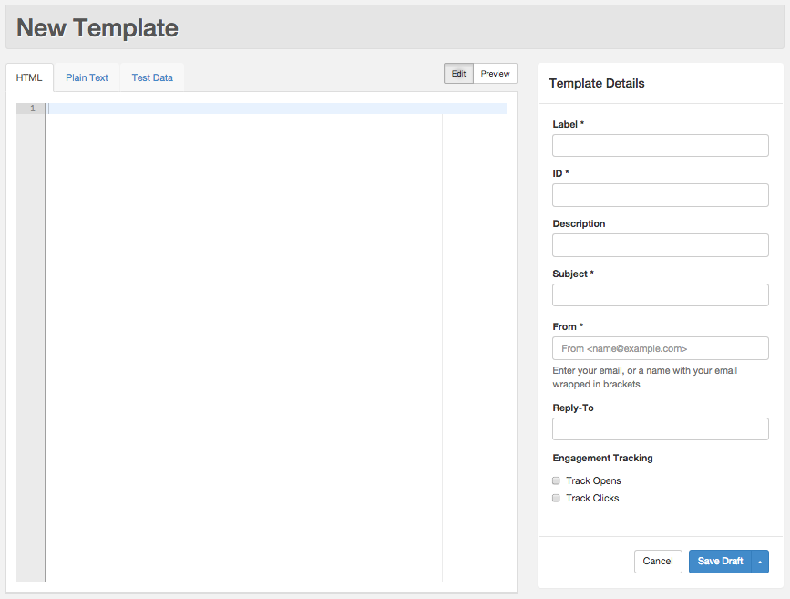
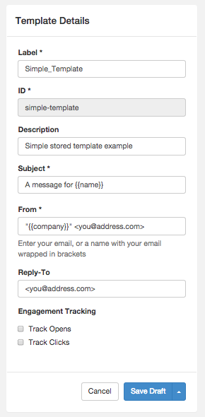
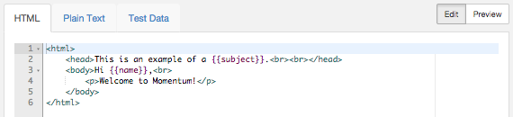
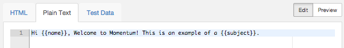

Logged in as: OmniTI, Inc.  ([logout](https://support.messagesystems.com/logout.php))

 

*   [Changelog](https://support.messagesystems.com/start.php?show=changelog)
*   [Documentation](https://support.messagesystems.com/docs/)
*   [Downloads](https://support.messagesystems.com/start.php)

*   [Licenses](https://support.messagesystems.com/license_summary.php)
*   <a href="">Clients</a>
    *   [Support](https://support.messagesystems.com/cs.php)
    *   [Add/Edit](https://support.messagesystems.com/edit_client.php)
    *   [Legal/Products](https://support.messagesystems.com/edit_products.php)
*   [Users](https://support.messagesystems.com/edit_customer.php)

## Search Help

Search for a single word or perform multi-word searches by enclosing your search in quotation marks.

Where you have multiple words but no quotation marks, an **OR** search is performed. For example, **"REST Injection"** searches for the phrase **"REST Injection"**, and, without quotation marks, searches for **REST OR Injection**--the operator is understood.

### Warning

You must escape the following special characters: **+ - && || ! ( ) { } [ ] ^ " ~ * ? : \**. Use the **\** character as the escape character. For example: **B0/00-11719-46C328D4\:default\:**

You can also perform **AND** searches, for example, **rest AND port** (no quotation marks) finds pages where both these words occur.

Terms used in searches are case-insensitive but operators are not. Alphabetic operators **must** be in uppercase.

Other operators can also be used. For more information see "[Query Parser Syntax](https://lucene.apache.org/core/old_versioned_docs/versions/3_0_0/queryparsersyntax.html)". Use of fields in searches is not currently supported.

| 48.2. Creating a Template |
| [Prev](web-ui.templates.php)  | Chapter 48. Managing Your Templates in the UI |  [Next](web-ui.templates.preview.php) |

## 48.2. Creating a Template

In the New Template form, you can specify your template details, enter your template content, preview and test your template using test data, and update your template. Templates can be saved as drafts or set to published.

### 48.2.1. Specifying Your Template Details

To open the New Template form, click the New Template icon in the upper-right corner of the Templates tab. The New Template form is shown in [Figure 48.2, “New Template”](web-ui.templates.create.php#figure_new_template "Figure 48.2. New Template").

**Figure 48.2. New Template**

Enter the following information under Template Details:

*   Label - User-friendly label for the template

*   ID - Short, unique, alphanumeric ID used to reference the template when it is used in a transmission

*   Description - (optional) Detailed description of the template

*   Subject - Email "Subject" line

*   From - Email address used to compose the email’s “From” header

*   Reply-To - (optional) Email address used to compose the email’s “Reply-To” header

By default, open tracking and click tracking are enabled in Momentum's configuration, if Message Generation is selected during installation. You can override this setting at the template or transmission level. To override open and click tracking at the template level, click the Track Opens option and/or Track Clicks option under Engagement Tracking.

### Note

The precedence for engagement tracking options, from highest to lowest is as follows:

*   transmission level

*   template level

*   msg_gen level

For example, if click tracking is not specified at the transmission level, the Track Clicks option at the template level is used. If the template level is also not specified, the setting of the configuration option in the msg_gen module is used.

If you want to disable engagement tracking globally, change the configuration option in the msg_gen module. See [Section 71.48, “msg_gen – Message Generation”](modules.msg_gen.php "71.48. msg_gen – Message Generation").

You can use substitution in the top-level header of your template (i.e. "Subject", "From", and "Reply-To"). The UI supports the same substitution features available in the API. For details about using substitution in your templates, see the Substitution Reference available at [Momentum 4 REST API](https://support.messagesystems.com/docs/web-rest/v1_index.htmlv1_index.html).

[Figure 48.3, “Template Details”](web-ui.templates.create.php#figure_template_details "Figure 48.3. Template Details") shows an example of a simple template. This example uses a simple form of direct substitution in "Subject" and "From". When the email is built, *`{{company}}`* and *`{{name}}`* will be replaced by the values you specify for a given recipient. Note that all details can be edited after the template has been created with the exception of the ID.

**Figure 48.3. Template Details**

### 48.2.2. Entering Your Template Content

In the New Template form, you can enter HTML content for the email’s text/html MIME part and text content for the email’s text/plain MIME part. Click Edit, select the appropriate tab, and type your content using the online editor. You can also use substitution in the message body of your template, enabling you to create personalized messages for every recipient.

An example of HTML content is shown in [Figure 48.4, “HTML Content”](web-ui.templates.create.php#figure_html_content "Figure 48.4. HTML Content"). This example uses a simple form of direct substitution. When the email is built, *`{{subject}}`* and *`{{name}}`* will be replaced by the values you specify for a given recipient.

**Figure 48.4. HTML Content**

An example of plain text content is shown in [Figure 48.5, “Text Content”](web-ui.templates.create.php#figure_text_content "Figure 48.5. Text Content").

**Figure 48.5. Text Content**

Click Save Draft in the New Template form to save your template as a draft. If successfully, a message indicating that your template was saved will be displayed briefly.

| [Prev](web-ui.templates.php)  | [Up](web-ui.templates.php) |  [Next](web-ui.templates.preview.php) |
| Chapter 48. Managing Your Templates in the UI  | [Table of Contents](index.php) |  48.3. Previewing and Testing Your Template |

Follow us on:

  