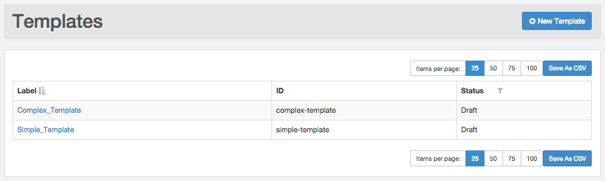

## Chapter 48. Managing Your Templates in the UI

**Table of Contents**

<dl class="toc">

<dt>[48.1\. Viewing Your Templates](web-ui.templates.php#web-ui.templates.view)</dt>

<dt>[48.2\. Creating a Template](web-ui.templates.create.php)</dt>

<dt>[48.3\. Previewing and Testing Your Template](web-ui.templates.preview.php)</dt>

<dt>[48.4\. Updating Your Template](web-ui.update.template.php)</dt>

<dt>[48.5\. Publishing Your Template](web-ui.templates.publish.php)</dt>

<dt>[48.6\. Deleting a Template](web-ui.templates.delete.php)</dt>

</dl>

**Configuration Change. ** Version 4.1 and later support managing your templates using the UI.

You can manage your templates using the Templates API or the Templates section in the UI. The UI enables you to easily view details about your templates, create new templates, preview, test, and update existing templates, publish your templates, and delete templates you no longer need.

## 48.1. Viewing Your Templates

The Templates tab provides a tabular view of your existing templates, as shown in [Figure 48.1, “Templates Table”](web-ui.templates.php#figure_templates_list "Figure 48.1. Templates Table"). The following information is displayed in the table for each template:

*   Label - Label specified when you created the template

    To view the description of a template, hover over the label.

*   ID - ID specified when you created the template

*   Status - Whether the template is a draft or has been published

**Figure 48.1. Templates Table**

Use the controls located above and below the table to select the number of items per page. You can sort by any column in ascending or descending order by clicking the sorting icon in the column header. This icon is visible in the header of the currently sorted column. If the icon is not visible, hover over the name in the header, and the icon will appear. You can also filter the templates by Draft or Published to display only the templates in each category. Click the filter icon in the header of the Status column to select a filter from the drop-down list.

You can export your template list to a CSV file. Click the Save as CSV button to export the data.

### Note

Internet Explorer, version 9 does not support exporting data to a CSV file. If you need this function, upgrade Internet Explorer or use Firefox.

To view the details of a template, click its label to open a detailed view.

| [Prev](stored_template.php)  | [Up](p.http_rest.php) |  [Next](web-ui.templates.create.php) |
| Chapter 47. Creating Stored Templates  | [Table of Contents](index.php) |  48.2. Creating a Template |

Follow us on:

  