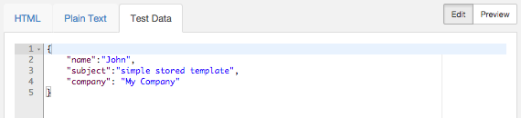
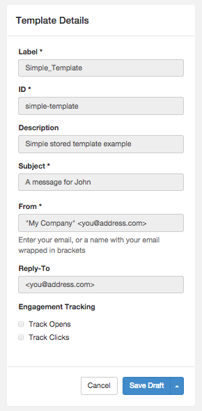
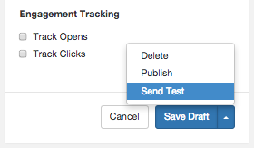
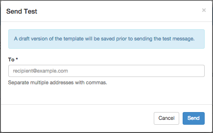

Logged in as: OmniTI, Inc.  ([logout](https://support.messagesystems.com/logout.php))

 

*   [Changelog](https://support.messagesystems.com/start.php?show=changelog)
*   [Documentation](https://support.messagesystems.com/docs/)
*   [Downloads](https://support.messagesystems.com/start.php)

*   [Licenses](https://support.messagesystems.com/license_summary.php)
*   <a href="">Clients</a>
    *   [Support](https://support.messagesystems.com/cs.php)
    *   [Add/Edit](https://support.messagesystems.com/edit_client.php)
    *   [Legal/Products](https://support.messagesystems.com/edit_products.php)
*   [Users](https://support.messagesystems.com/edit_customer.php)

## Search Help

Search for a single word or perform multi-word searches by enclosing your search in quotation marks.

Where you have multiple words but no quotation marks, an **OR** search is performed. For example, **"REST Injection"** searches for the phrase **"REST Injection"**, and, without quotation marks, searches for **REST OR Injection**--the operator is understood.

### Warning

You must escape the following special characters: **+ - && || ! ( ) { } [ ] ^ " ~ * ? : \**. Use the **\** character as the escape character. For example: **B0/00-11719-46C328D4\:default\:**

You can also perform **AND** searches, for example, **rest AND port** (no quotation marks) finds pages where both these words occur.

Terms used in searches are case-insensitive but operators are not. Alphabetic operators **must** be in uppercase.

Other operators can also be used. For more information see "[Query Parser Syntax](https://lucene.apache.org/core/old_versioned_docs/versions/3_0_0/queryparsersyntax.html)". Use of fields in searches is not currently supported.

| 48.3. Previewing and Testing Your Template |
| [Prev](web-ui.templates.create.php)  | Chapter 48. Managing Your Templates in the UI |  [Next](web-ui.update.template.php) |

## 48.3. Previewing and Testing Your Template

You can preview and test your template by specifying test data in the New Template form. Test data must be in the form of a JSON object of key/value pairs of recipient-specific data. Click Edit, select the Test Data tab, and type your test data using the online editor. Note that the test data is not saved.

[Figure 48.6, “Test Data”](web-ui.templates.preview.php#figure_test_data "Figure 48.6. Test Data") shows test data for the Simple Template. In this example, *John*, *simple stored template* , and *My Company*         will replace *`{{name}}`*, *`{{subject}}`*, and *`{{company}}`*, respectively, in the preview of your template.

**Figure 48.6. Test Data**

### 48.3.1. Previewing Your Email

You can preview the HTML content, plain text content, and top-level header substitution of your email using the UI. To preview your template, click Preview and select the appropriate tab.

[Figure 48.7, “Preview Template”](web-ui.templates.preview.php#figure_preview_template "Figure 48.7. Preview Template") shows a preview of the HMTL content for the Simple Template. Notice the substitution for *`{{name}}`* and *`{{subject}}`*.

**Figure 48.7. Preview Template**

[Figure 48.8, “Preview Template Details”](web-ui.templates.preview.php#figure_preview_details "Figure 48.8. Preview Template Details") shows a preview of the Template Details for the Simple Template. Notice the substitution for *`{{name}}`* and *`{{company}}`*.

**Figure 48.8. Preview Template Details**

### 48.3.2. Sending a Test Email

In addition to the preview function, you can send a test email from the UI, using your test data to expand your template. Click the arrow on the right-hand side of the Save Draft button. In the list, click Send Test.

**Figure 48.9. Send Test**

In the Sent Test form, enter your recipient's address and click Send.

**Figure 48.10. Send Test Form**

If successful, a message will briefly appear indicating that your message was successfully queued. Your recipient should receive an email with your test data included in the message body.

| [Prev](web-ui.templates.create.php)  | [Up](web-ui.templates.php) |  [Next](web-ui.update.template.php) |
| 48.2. Creating a Template  | [Table of Contents](index.php) |  48.4. Updating Your Template |

Follow us on:

  