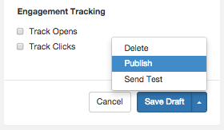

| 48.5. Publishing Your Template |
| [Prev](web-ui.update.template.php)  | Chapter 48. Managing Your Templates in the UI |  [Next](web-ui.templates.delete.php) |

## 48.5. Publishing Your Template

Publishing a template makes the published version the default for transmissions that use the template. You can continue to use a template's draft version, if any, by specifying its use in the transmission API request.

To publish your template, click the arrow on the right-hand side of the Save Draft button. In the list, click Publish, as shown in [Figure 48.11, “Publish Template”](web-ui.templates.publish.php#figure_publish_template "Figure 48.11. Publish Template").

**Figure 48.11. Publish Template**

A published template can still be edited, either by editing the published version or by creating a new draft.

| [Prev](web-ui.update.template.php)  | [Up](web-ui.templates.php) |  [Next](web-ui.templates.delete.php) |
| 48.4. Updating Your Template  | [Table of Contents](index.php) |  48.6. Deleting a Template |

Follow us on:

  