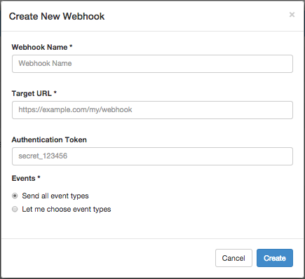
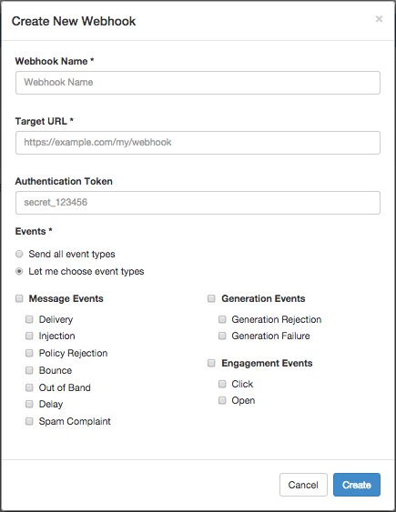

Logged in as: OmniTI, Inc.  ([logout](https://support.messagesystems.com/logout.php))

 

*   [Changelog](https://support.messagesystems.com/start.php?show=changelog)
*   [Documentation](https://support.messagesystems.com/docs/)
*   [Downloads](https://support.messagesystems.com/start.php)

*   [Licenses](https://support.messagesystems.com/license_summary.php)
*   <a href="">Clients</a>
    *   [Support](https://support.messagesystems.com/cs.php)
    *   [Add/Edit](https://support.messagesystems.com/edit_client.php)
    *   [Legal/Products](https://support.messagesystems.com/edit_products.php)
*   [Users](https://support.messagesystems.com/edit_customer.php)

## Search Help

Search for a single word or perform multi-word searches by enclosing your search in quotation marks.

Where you have multiple words but no quotation marks, an **OR** search is performed. For example, **"REST Injection"** searches for the phrase **"REST Injection"**, and, without quotation marks, searches for **REST OR Injection**--the operator is understood.

### Warning

You must escape the following special characters: **+ - && || ! ( ) { } [ ] ^ " ~ * ? : \**. Use the **\** character as the escape character. For example: **B0/00-11719-46C328D4\:default\:**

You can also perform **AND** searches, for example, **rest AND port** (no quotation marks) finds pages where both these words occur.

Terms used in searches are case-insensitive but operators are not. Alphabetic operators **must** be in uppercase.

Other operators can also be used. For more information see "[Query Parser Syntax](https://lucene.apache.org/core/old_versioned_docs/versions/3_0_0/queryparsersyntax.html)". Use of fields in searches is not currently supported.

| 60.2. Creating a Webhook |
| [Prev](web-ui.webhooks.php)  | Chapter 60. Managing Your Webhooks in the UI |  [Next](web-ui.webhooks.test.php) |

## 60.2. Creating a Webhook

In the Webhooks tab, click the New Webhook icon in the upper-right corner to open the Create New Webhook form, as shown in [Figure 60.2, “Create New Webhook”](web-ui.webhooks.create.php#figure_create_webhook "Figure 60.2. Create New Webhook").

**Figure 60.2. Create New Webhook**

Enter the following information:

*   Webhook Name - User-friendly name for the webhook

*   Target URL - URL of the target to which to post data

*   Authentication - (optional) Authentication token to present in the X-MessageSystems-Webhook-Token header of POST requests to the target URL

    Use this token in your target application to confirm that data is coming from your webhook.

To receive all event types on the webhook, click the Send all event types option. If you want only select event types, click the Let me choose event types option and select from the list displayed. Events are categorized as Message, Generation, or Engagement , as shown in [Figure 60.3, “Event Types”](web-ui.webhooks.create.php#figure_event_types "Figure 60.3. Event Types").

**Figure 60.3. Event Types**

When complete, click Create to create your new webhook.

On creation, a test POST is sent to the target URL for validation. If this request does not receive an HTTP 200 response, the webhook will not be created, and you will receive a validation error in the Create New Webhook form.

If the test POST is successful, a message will briefly display upon return to the Webhooks tab. The events that you selected will begin to be posted to the target URL after after a 1 minute activation time.

| [Prev](web-ui.webhooks.php)  | [Up](web-ui.webhooks.php) |  [Next](web-ui.webhooks.test.php) |
| Chapter 60. Managing Your Webhooks in the UI  | [Table of Contents](index.php) |  60.3. Testing Your Webhook |

Follow us on:

  