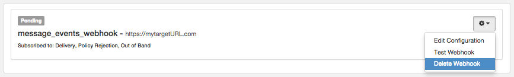
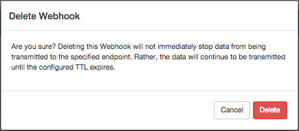

Logged in as: OmniTI, Inc.  ([logout](https://support.messagesystems.com/logout.php))

 

*   [Changelog](https://support.messagesystems.com/start.php?show=changelog)
*   [Documentation](https://support.messagesystems.com/docs/)
*   [Downloads](https://support.messagesystems.com/start.php)

*   [Licenses](https://support.messagesystems.com/license_summary.php)
*   <a href="">Clients</a>
    *   [Support](https://support.messagesystems.com/cs.php)
    *   [Add/Edit](https://support.messagesystems.com/edit_client.php)
    *   [Legal/Products](https://support.messagesystems.com/edit_products.php)
*   [Users](https://support.messagesystems.com/edit_customer.php)

## Search Help

Search for a single word or perform multi-word searches by enclosing your search in quotation marks.

Where you have multiple words but no quotation marks, an **OR** search is performed. For example, **"REST Injection"** searches for the phrase **"REST Injection"**, and, without quotation marks, searches for **REST OR Injection**--the operator is understood.

### Warning

You must escape the following special characters: **+ - && || ! ( ) { } [ ] ^ " ~ * ? : \**. Use the **\** character as the escape character. For example: **B0/00-11719-46C328D4\:default\:**

You can also perform **AND** searches, for example, **rest AND port** (no quotation marks) finds pages where both these words occur.

Terms used in searches are case-insensitive but operators are not. Alphabetic operators **must** be in uppercase.

Other operators can also be used. For more information see "[Query Parser Syntax](https://lucene.apache.org/core/old_versioned_docs/versions/3_0_0/queryparsersyntax.html)". Use of fields in searches is not currently supported.

| 60.5. Deleting a Webhook |
| [Prev](web-ui.webhooks.update.php)  | Chapter 60. Managing Your Webhooks in the UI |  [Next](engagement_tracking_http.php) |

## 60.5. Deleting a Webhook

From the Webhooks tab, you can delete a webhook. Click the icon in the upper-right corner of the webhook you want to delete. In the list, click Delete Webhook, as shown in [Figure 60.9, “Delete Webhook”](web-ui.webhooks.delete.php#figure_delete_webhook "Figure 60.9. Delete Webhook").

**Figure 60.9. Delete Webhook**

In the Delete Webhook window, click Delete to confirm your request, as shown in [Figure 60.10, “Confirm Delete”](web-ui.webhooks.delete.php#figure_confirm_delete "Figure 60.10. Confirm Delete").

**Figure 60.10. Confirm Delete**

The system will stop posting data to the target URL after the batches currently queued to be delivered are drained.

| [Prev](web-ui.webhooks.update.php)  | [Up](web-ui.webhooks.php) |  [Next](engagement_tracking_http.php) |
| 60.4. Updating Your Webhook  | [Table of Contents](index.php) |  Chapter 61. Tracking Engagement for HTTP |

Follow us on:

  