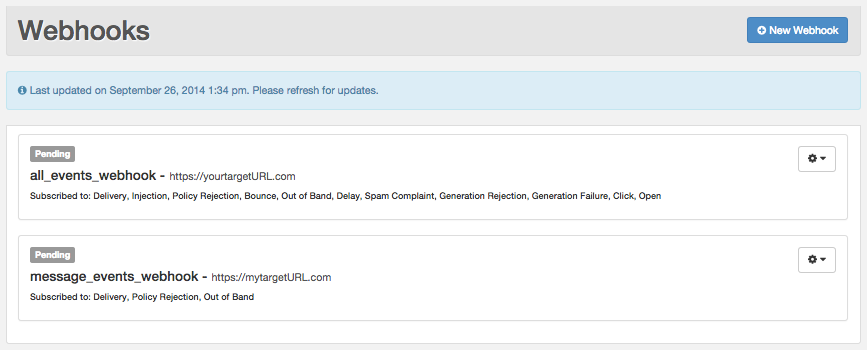

Logged in as: OmniTI, Inc.  ([logout](https://support.messagesystems.com/logout.php))

[](https://support.messagesystems.com/start.php) 

*   [Changelog](https://support.messagesystems.com/start.php?show=changelog)
*   [Documentation](https://support.messagesystems.com/docs/)
*   [Downloads](https://support.messagesystems.com/start.php)

*   [Licenses](https://support.messagesystems.com/license_summary.php)
*   <a href="">Clients</a>
    *   [Support](https://support.messagesystems.com/cs.php)
    *   [Add/Edit](https://support.messagesystems.com/edit_client.php)
    *   [Legal/Products](https://support.messagesystems.com/edit_products.php)
*   [Users](https://support.messagesystems.com/edit_customer.php)

## Search Help

Search for a single word or perform multi-word searches by enclosing your search in quotation marks.

Where you have multiple words but no quotation marks, an **OR** search is performed. For example, **"REST Injection"** searches for the phrase **"REST Injection"**, and, without quotation marks, searches for **REST OR Injection**--the operator is understood.

### Warning

You must escape the following special characters: **+ - && || ! ( ) { } [ ] ^ " ~ * ? : \**. Use the **\** character as the escape character. For example: **B0/00-11719-46C328D4\:default\:**

You can also perform **AND** searches, for example, **rest AND port** (no quotation marks) finds pages where both these words occur.

Terms used in searches are case-insensitive but operators are not. Alphabetic operators **must** be in uppercase.

Other operators can also be used. For more information see "[Query Parser Syntax](https://lucene.apache.org/core/old_versioned_docs/versions/3_0_0/queryparsersyntax.html)". Use of fields in searches is not currently supported.

| Chapter 60. Managing Your Webhooks in the UI |
| [Prev](reporting_webhooks.php)  | Part VIII. Reporting and Engagement Tracking |  [Next](web-ui.webhooks.create.php) |

## Chapter 60. Managing Your Webhooks in the UI

**Table of Contents**

<dl class="toc">

<dt>[60.1\. Viewing Your Webhooks](web-ui.webhooks.php#web-ui.webhooks.viewing)</dt>

<dt>[60.2\. Creating a Webhook](web-ui.webhooks.create.php)</dt>

<dt>[60.3\. Testing Your Webhook](web-ui.webhooks.test.php)</dt>

<dt>[60.4\. Updating Your Webhook](web-ui.webhooks.update.php)</dt>

<dt>[60.5\. Deleting a Webhook](web-ui.webhooks.delete.php)</dt>

</dl>

<a class="indexterm" name="idp4523056"></a>

**Configuration Change. ** Version 4.1 and later support managing your webhooks using the UI. Version 4.2 and later add adaptive delivery events.

You can manage your webhooks using the Webhooks API or the Webhooks section in the UI. The UI provides a flexible, easy-to-use interface to view details about your webhooks, create new webhooks, test and update existing webhooks, and delete webhooks you no longer need.

## 60.1. Viewing Your Webhooks

The Webhooks tab displays details about your existing webhooks. The following information is displayed for each webhook:

*   Name specified when you created the webhook

*   Status of the webhooks

    *   Pending - No batches yet received for this webhook

    *   OK - All batches within the last 24 hours have been successfully delivered

    *   Failed - At least one batch within the last 24 hours has failed

*   Target URL to which the data is posted

*   Event types the webhook will receive

[Figure 60.1, “Webhooks List”](web-ui.webhooks.php#figure_webhooks_list "Figure 60.1. Webhooks List") shows two example webhooks. The all_events_webhook will receive all event types on *`yourtargetURL.com`*; while the message_events_webhook will receive only Delivery, Policy Rejection, and Out-of-Band events on *`mytargetURL.com`*.

<a name="figure_webhooks_list"></a>

**Figure 60.1. Webhooks List**



To create a webhook that meets your specific requirements, you must understand the events being posted to the webhook. Events are categorized as message, generation, or engagement.

Message events describe the life cycle of a message including injection, delivery, and disposition. The following are the available message events:

*   Delivery - Remote mail transfer agent (MTA) acknowledged receipt of a message.

*   Injection - Message is received by or injected into Momentum.

*   Policy Rejection - Due to policy, Momentum rejected a message or failed to generate a message.

*   Bounce - Remote MTA has permanently rejected a message.

*   Out-of-Band - Remote MTA initially reported acceptance of a message, but it has since asynchronously reported that the message was not delivered.

*   Delay - Remote MTA has temporarily rejected a message.

*   Spam Complaint - Message was classified as spam, whether manually or programmatically.

Generation events provide insight into message generation failures or rejections. The following are the available generation events:

*   Generation Rejection - Momentum rejected message generation due to policy.

*   Generation Failure - Message generation failed for an intended recipient.

Engagement events describe the behavior of a recipient with respect to the message sent. The following are the available engagement events:

*   Click - Recipient clicked a tracked link in a message, thus prompting a redirect through the Momentum click-tracking server to the link’s destination.

*   Open - Recipient opened a message in a mail client, thus rendering a tracking pixel.

Adaptive delivery events occur when Momentum receives a negative response from an ISP that relates to maintaining a reputable deliverability status. The following are the available adaptive delivery events:

*   Status – A negative ISP response triggers an adaptive rule, and Momentum took action to adjust its sending patterns.

*   Adjustment – Momentum changed a low-level parameter as a result of an adaptive rule being triggered or automatic performance tuning.

A batch of event data transmitted to a webhook consists of one or more event records, each composed of a payload wrapped in a type-specific envelope as described for each event type. Each event record payload includes the data fields specific to that event type.

For example, the message_events_webhook is subscribed to "delivery", "policy rejection", and "out-of-band event" types. It's message event batch includes only that data specific to those events. The following shows an example "delivery" payload.

```
{
	"msys": {
		"message_event": {
		"type": "delivery",
		"recv_method": "esmtp",
		"delv_method": "esmtp",
		"node_name": "Test-Node",
		"timestamp": "1411751722.079",
		"binding_group": "Test-Binding-Group",
		"binding": "Test-Binding",
		"routing_domain": "example.com",
		"queue_time": "1234",
		"msg_size": "131072",
		"num_retries": "5",
		"message_id": "fb238d87-deaf-427e-91e6-da675ecea2a4",
		"campaign_id": "Test Campaign Name",
		"template_id": "Test Template Name",
		"conn_stage": "22",
		"conn_name": "00/00-00000-00000000",
		"msg_spoolname": "20/00-29338-62AF3C35",
		"transmission_id": "65832146450776065",
		"rcpt_meta": {},
		"customer_id": "1",
		"rcpt_tags": [],
		"msg_batchname": "10/00-29338-62AF3C35"
		}
	}
}
```

For the field definitions and a mapping of the fields that constitute a payload for a given event type, use the Webhook Events and Webhook Sample Events endpoints. See the Webhooks API documentation available at [Momentum 4 REST API](https://support.messagesystems.com/docs/web-rest/v1_index.html).

Using the UI, you can create webhooks to post data for any of the event types listed above.

| [Prev](reporting_webhooks.php)  | [Up](p.analytics.php) |  [Next](web-ui.webhooks.create.php) |
| Chapter 59. Using Webhooks for Event Data  | [Table of Contents](index.php) |  60.2. Creating a Webhook |

Follow us on:

[](http://www.facebook.com/messagesystems) [](http://twitter.com/#!/MessageSystems) [](http://www.linkedin.com/company/message-systems)