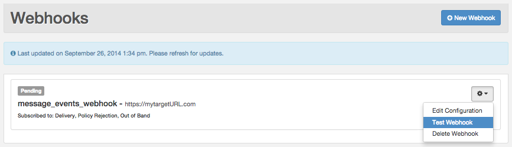
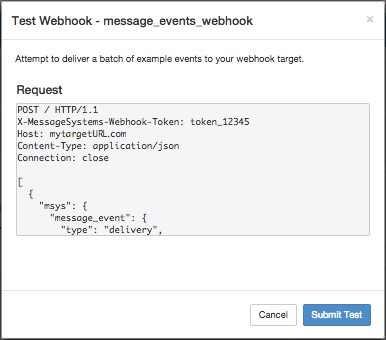
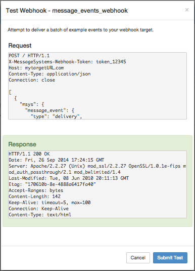

Logged in as: OmniTI, Inc.  ([logout](https://support.messagesystems.com/logout.php))

 

*   [Changelog](https://support.messagesystems.com/start.php?show=changelog)
*   [Documentation](https://support.messagesystems.com/docs/)
*   [Downloads](https://support.messagesystems.com/start.php)

*   [Licenses](https://support.messagesystems.com/license_summary.php)
*   <a href="">Clients</a>
    *   [Support](https://support.messagesystems.com/cs.php)
    *   [Add/Edit](https://support.messagesystems.com/edit_client.php)
    *   [Legal/Products](https://support.messagesystems.com/edit_products.php)
*   [Users](https://support.messagesystems.com/edit_customer.php)

## Search Help

Search for a single word or perform multi-word searches by enclosing your search in quotation marks.

Where you have multiple words but no quotation marks, an **OR** search is performed. For example, **"REST Injection"** searches for the phrase **"REST Injection"**, and, without quotation marks, searches for **REST OR Injection**--the operator is understood.

### Warning

You must escape the following special characters: **+ - && || ! ( ) { } [ ] ^ " ~ * ? : \**. Use the **\** character as the escape character. For example: **B0/00-11719-46C328D4\:default\:**

You can also perform **AND** searches, for example, **rest AND port** (no quotation marks) finds pages where both these words occur.

Terms used in searches are case-insensitive but operators are not. Alphabetic operators **must** be in uppercase.

Other operators can also be used. For more information see "[Query Parser Syntax](https://lucene.apache.org/core/old_versioned_docs/versions/3_0_0/queryparsersyntax.html)". Use of fields in searches is not currently supported.

| 60.3. Testing Your Webhook |
| [Prev](web-ui.webhooks.create.php)  | Chapter 60. Managing Your Webhooks in the UI |  [Next](web-ui.webhooks.update.php) |

## 60.3. Testing Your Webhook

In addition to the validation performed when you create your webhook, you can test your webhook by posting an example message event batch to the target URL. The test sends an HTTP request to the client endpoint in the same way that the batch transmitter will. This test will validate that the target responds with an "OK" (i.e. HTTP 200) and return a detailed information response.

From the Webhooks tab, click the icon in the upper-right corner of the webhook you want to test. In the drop-down list, click Test Webhook, as shown in [Figure 60.4, “Test Webhook”](web-ui.webhooks.test.php#figure_test_webhook "Figure 60.4. Test Webhook").

**Figure 60.4. Test Webhook**

The Test Webhook window displays the example message event batch that will be posted to your target webhook, as shown in [Figure 60.5, “Test Request”](web-ui.webhooks.test.php#figure_test_request "Figure 60.5. Test Request"). The Request shows the full content of the HTTP request, which is exactly the same as what the batch transmitter would send to the client endpoint. To continue with the test, click Submit Test.

**Figure 60.5. Test Request**

The test returns a detailed information response, as shown in [Figure 60.6, “Test Response”](web-ui.webhooks.test.php#figure_test_response "Figure 60.6. Test Response").

**Figure 60.6. Test Response**

The Response shows the full content of the HTTP response sent by the client endpoint after receiving the test request. It includes a standard HTTP status. In the example response, the "OK" (`HTTP/1.1 200`) indicates that the example message event batch was successfully posted to the target URL. Any other response code indicates some type of error.

| [Prev](web-ui.webhooks.create.php)  | [Up](web-ui.webhooks.php) |  [Next](web-ui.webhooks.update.php) |
| 60.2. Creating a Webhook  | [Table of Contents](index.php) |  60.4. Updating Your Webhook |

Follow us on:

  