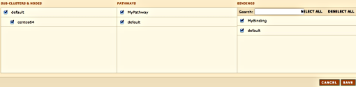
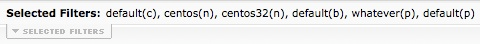

Logged in as: OmniTI, Inc.  ([logout](https://support.messagesystems.com/logout.php))

 

*   [Changelog](https://support.messagesystems.com/start.php?show=changelog)
*   [Documentation](https://support.messagesystems.com/docs/)
*   [Downloads](https://support.messagesystems.com/start.php)

*   [Licenses](https://support.messagesystems.com/license_summary.php)
*   <a href="">Clients</a>
    *   [Support](https://support.messagesystems.com/cs.php)
    *   [Add/Edit](https://support.messagesystems.com/edit_client.php)
    *   [Legal/Products](https://support.messagesystems.com/edit_products.php)
*   [Users](https://support.messagesystems.com/edit_customer.php)

## Search Help

Search for a single word or perform multi-word searches by enclosing your search in quotation marks.

Where you have multiple words but no quotation marks, an **OR** search is performed. For example, **"REST Injection"** searches for the phrase **"REST Injection"**, and, without quotation marks, searches for **REST OR Injection**--the operator is understood.

### Warning

You must escape the following special characters: **+ - && || ! ( ) { } [ ] ^ " ~ * ? : \**. Use the **\** character as the escape character. For example: **B0/00-11719-46C328D4\:default\:**

You can also perform **AND** searches, for example, **rest AND port** (no quotation marks) finds pages where both these words occur.

Terms used in searches are case-insensitive but operators are not. Alphabetic operators **must** be in uppercase.

Other operators can also be used. For more information see "[Query Parser Syntax](https://lucene.apache.org/core/old_versioned_docs/versions/3_0_0/queryparsersyntax.html)". Use of fields in searches is not currently supported.

| 3.5. Filtering |
| [Prev](web3.status.php)  | Chapter 3. Using the Web Console |  [Next](web3.reports.php) |

## 3.5. Filtering

In addition to selecting a specific domain you can also filter for specific subclusters, nodes, bindings and, in Momentum for Receiving, pathways. To do this choose the Filter menu option. You should see something similar to the following:

**Figure 3.8. Filtering**

In the SUB_CLUSTERS & NODES section, as a minimum, you must select at least one sub-cluster or one node. Failure to do so results in the following error message: `The subcluster / node selection must contain at least one subcluster or node.` The SUB_CLUSTERS & NODES configuration then reverts to the previous configuration.

In addition to selecting the nodes and subclusters you can also select a specific binding from the list of bindings that appears on the right hand side of the page. As of version 3.0.23, you can also filter pathways.

To select all bindings, click the SELECT ALL link and to deselect all bindings use the DESELECT ALL link.

The filters that you choose show up as the Selected Filters on any web page.

**Figure 3.9. Selected Filters**

The meanings of the letters in parentheses are as follows:

*   `c` – cluster

*   `n` – node

*   `b` – binding

*   `p` – pathway (since 3.0.23)

You can toggle the display of selected filters by clicking the Selected Filters tab.

| [Prev](web3.status.php)  | [Up](web3.php) |  [Next](web3.reports.php) |
| 3.4. Cluster Status  | [Table of Contents](index.php) |  3.6. The Reporting Page |

Follow us on:

  