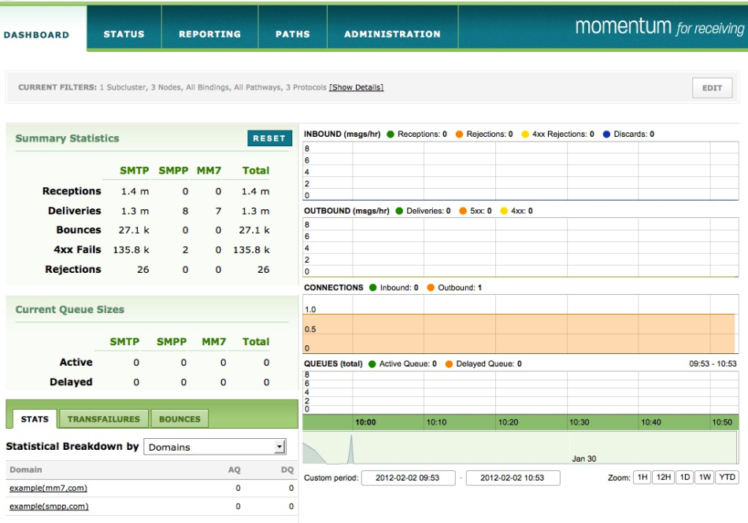

Logged in as: OmniTI, Inc.  ([logout](https://support.messagesystems.com/logout.php))

 

*   [Changelog](https://support.messagesystems.com/start.php?show=changelog)
*   [Documentation](https://support.messagesystems.com/docs/)
*   [Downloads](https://support.messagesystems.com/start.php)

*   [Licenses](https://support.messagesystems.com/license_summary.php)
*   <a href="">Clients</a>
    *   [Support](https://support.messagesystems.com/cs.php)
    *   [Add/Edit](https://support.messagesystems.com/edit_client.php)
    *   [Legal/Products](https://support.messagesystems.com/edit_products.php)
*   [Users](https://support.messagesystems.com/edit_customer.php)

## Search Help

Search for a single word or perform multi-word searches by enclosing your search in quotation marks.

Where you have multiple words but no quotation marks, an **OR** search is performed. For example, **"REST Injection"** searches for the phrase **"REST Injection"**, and, without quotation marks, searches for **REST OR Injection**--the operator is understood.

### Warning

You must escape the following special characters: **+ - && || ! ( ) { } [ ] ^ " ~ * ? : \**. Use the **\** character as the escape character. For example: **B0/00-11719-46C328D4\:default\:**

You can also perform **AND** searches, for example, **rest AND port** (no quotation marks) finds pages where both these words occur.

Terms used in searches are case-insensitive but operators are not. Alphabetic operators **must** be in uppercase.

Other operators can also be used. For more information see "[Query Parser Syntax](https://lucene.apache.org/core/old_versioned_docs/versions/3_0_0/queryparsersyntax.html)". Use of fields in searches is not currently supported.

| 3.2. Web Console Overview |
| [Prev](web3.starting.web.console.php)  | Chapter 3. Using the Web Console |  [Next](web3.dashboard.php) |

## 3.2. Web Console Overview

The web console opens on the dashboard—a page that gives you a quick overview of the state of your system. The menu options are as shown below.

**Figure 3.1. Overview**

The reporting page offers a more specific view of the data presented on the dashboard page and the administrative page is used to change your configuration and to manage users while the status page displays the status of your installation. In a cluster configuration it displays a status line for each node, providing an easy means of determining that your nodes are online.

### Note

[Figure 3.1, “Overview”](web3.overview.php#figure_console_overview "Figure 3.1. Overview") shows Momentum for Receiving. Momentum for Sending does not have a Paths menu option.

As of version 3.4, domain information is available under the REPORTING menu only.

| [Prev](web3.starting.web.console.php)  | [Up](web3.php) |  [Next](web3.dashboard.php) |
| 3.1. Starting the Web Console  | [Table of Contents](index.php) |  3.3. The Dashboard |

Follow us on:

  