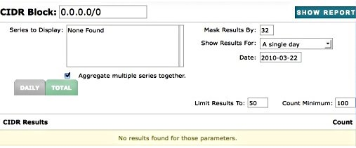
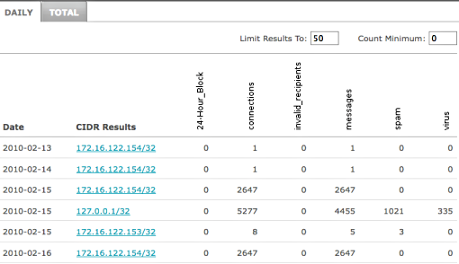

Logged in as: OmniTI, Inc.  ([logout](https://support.messagesystems.com/logout.php))

 

*   [Changelog](https://support.messagesystems.com/start.php?show=changelog)
*   [Documentation](https://support.messagesystems.com/docs/)
*   [Downloads](https://support.messagesystems.com/start.php)

*   [Licenses](https://support.messagesystems.com/license_summary.php)
*   <a href="">Clients</a>
    *   [Support](https://support.messagesystems.com/cs.php)
    *   [Add/Edit](https://support.messagesystems.com/edit_client.php)
    *   [Legal/Products](https://support.messagesystems.com/edit_products.php)
*   [Users](https://support.messagesystems.com/edit_customer.php)

## Search Help

Search for a single word or perform multi-word searches by enclosing your search in quotation marks.

Where you have multiple words but no quotation marks, an **OR** search is performed. For example, **"REST Injection"** searches for the phrase **"REST Injection"**, and, without quotation marks, searches for **REST OR Injection**--the operator is understood.

### Warning

You must escape the following special characters: **+ - && || ! ( ) { } [ ] ^ " ~ * ? : \**. Use the **\** character as the escape character. For example: **B0/00-11719-46C328D4\:default\:**

You can also perform **AND** searches, for example, **rest AND port** (no quotation marks) finds pages where both these words occur.

Terms used in searches are case-insensitive but operators are not. Alphabetic operators **must** be in uppercase.

Other operators can also be used. For more information see "[Query Parser Syntax](https://lucene.apache.org/core/old_versioned_docs/versions/3_0_0/queryparsersyntax.html)". Use of fields in searches is not currently supported.

| 3.7. The Paths Page |
| [Prev](web3.reports.php)  | Chapter 3. Using the Web Console |  [Next](web3.administration.php) |

## 3.7. The Paths Page

**Configuration Change. ** This feature is available starting from Momentum 3.0.23.

As of version 3.0.23, the Paths page is available for Momentum for Receiving. When Momentum is first installed, no audit series are displayed on this page.

**Figure 3.30. Paths**

In order to populate the Series to display text area, set up audit_series for the types of events you wish to view such as connections, messages and spam. In order to do this you must first load and configure the inbound_audit module. For instructions on doing this see [inbound_audit](https://support.messagesystems.com/docs/web-ref/modules.inbound_audit.php).

Once the inbound_audit module is loaded, you can create audit series as described in [Sieve audit_series](https://support.messagesystems.com/docs/web/sieve.ecaddons.php#sieve.ectypes_audit_series) and [audit_series](https://support.messagesystems.com/docs/web/sieve.ref.audit_series.php). The audit series that you create will show up in the Series to display text area. Select a CIDR block and the series that you wish to display and click the SHOW REPORT button. You should see something similar to the following:

**Figure 3.31. CIDR results**

The audit series that you select are displayed to the right of the IP address. To view the details for a specific IP address, click the IP address.

| [Prev](web3.reports.php)  | [Up](web3.php) |  [Next](web3.administration.php) |
| 3.6. The Reporting Page  | [Table of Contents](index.php) |  3.8. Administration |

Follow us on:

  