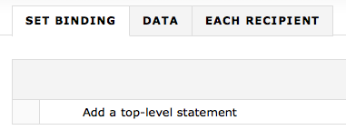
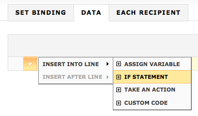
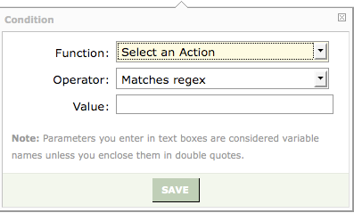
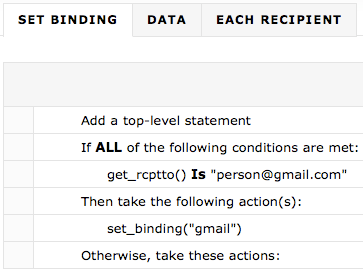
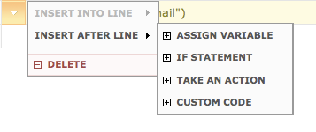

Logged in as: OmniTI, Inc.  ([logout](https://support.messagesystems.com/logout.php))

[](https://support.messagesystems.com/start.php) 

*   [Changelog](https://support.messagesystems.com/start.php?show=changelog)
*   [Documentation](https://support.messagesystems.com/docs/)
*   [Downloads](https://support.messagesystems.com/start.php)

*   [Licenses](https://support.messagesystems.com/license_summary.php)
*   <a href="">Clients</a>
    *   [Support](https://support.messagesystems.com/cs.php)
    *   [Add/Edit](https://support.messagesystems.com/edit_client.php)
    *   [Legal/Products](https://support.messagesystems.com/edit_products.php)
*   [Users](https://support.messagesystems.com/edit_customer.php)

## Search Help

Search for a single word or perform multi-word searches by enclosing your search in quotation marks.

Where you have multiple words but no quotation marks, an **OR** search is performed. For example, **"REST Injection"** searches for the phrase **"REST Injection"**, and, without quotation marks, searches for **REST OR Injection**--the operator is understood.

### Warning

You must escape the following special characters: **+ - && || ! ( ) { } [ ] ^ " ~ * ? : \**. Use the **\** character as the escape character. For example: **B0/00-11719-46C328D4\:default\:**

You can also perform **AND** searches, for example, **rest AND port** (no quotation marks) finds pages where both these words occur.

Terms used in searches are case-insensitive but operators are not. Alphabetic operators **must** be in uppercase.

Other operators can also be used. For more information see "[Query Parser Syntax](https://lucene.apache.org/core/old_versioned_docs/versions/3_0_0/queryparsersyntax.html)". Use of fields in searches is not currently supported.

| 3.10. The Policy Configuration Editor |
| [Prev](web3.users.php)  | Chapter 3. Using the Web Console |  [Next](web3.automated.alerting.php) |

## 3.10. The Policy Configuration Editor

In version 3.0 of Momentum you can implement policy using the policy editor. To use the editor, navigate to the Administration page and choose the Policy Configuration Editor. You should see a screen similar to the following:

<a name="figure_configuring_policy"></a>

**Figure 3.46. Configuring policy**



There are three phases that policies may be bound to. These are:

*   `Data` – This phase executes first and is analogous to the Sieve++ data_phase1\. Scriptlets in this phase are called after the entire body of the message has been received. Additionally, this phase is called only once per message (as opposed to once for each recipient).

    During this phase, calling `get_rcptto` doesn't make sense as there could be multiple recipients for the message.

*   `Each Recipient` – Prior to execution of this phase, one message is created for all RCPT TOs found in the envelope. This phase handler is then called for each of these messages.

    Beginning in this phase, `get_rcptto` can be used to determine the destination address of the message and destination-based policy decisions can be made. This is the second phase.

*   `Set Binding` – This phase, like the `Each Recipient` phase, is called once for each recipient of a message. It is the only phase that may successfully set a binding or binding group.

    If you wish to set a binding based on the results of a previous phase, you should use the `vctx_mess_*` or `vctx_conn_*` functions to do this. For more information about these functions see [Section 3.10.2, “Actions”](web3.policy.editor.php#web3.script.actions "3.10.2. Actions"). Setter functions should be used in previous phases, and getter functions in this phase.

    The `Set Binding` phase executes last.

To create policy scripts you must have the alerting module installed. The default configuration file contains this module but if you migrated from Momentum version 2.2, you will need to add it. For instructions on adding this module see [Section 3.8.1.6, “Adding a Module”](web3.administration.php#web3.adding_module "3.8.1.6. Adding a Module").

### Note

If you are familiar with Lua, you can write your own policy scripts without the help of the web UI. For more information see [Section 5.2, “Implementing Policy Using Scriptlets”](implementing.policy.scriptlets.php "5.2. Implementing Policy Using Scriptlets"). Note that scripts created manually cannot be edited in the web UI and those created using the web UI cannot be edited by hand.

### 3.10.1. Creating a Script

To create a script to execute during the data phase first select the DATA tab. Mouse over the Add a top-level statement line to expose the down arrow. Click this arrow and choose INSERT INTO LINE and IF STATEMENT. You should see something similar to the following image.

<a name="figure_creating_script"></a>

**Figure 3.47. Creating a script**



Use the ASSIGN VARIABLE option to assign a value to a variable. If you know Lua and wish to create custom code, choose the CUSTOM CODE option.

Clicking IF STATEMENT produces the following output:

<a name="figure_adding_condition"></a>

**Figure 3.48. Adding a condition**


To add a condition to the `if` statement mouse over the line If ALL of the following conditions are met:, click the down arrow and choose to insert a condition. Doing this opens the condition dialog box.

<a name="figure_condition_dialog"></a>

**Figure 3.49. Condition dialog box**



Create a condition by selecting a function, an operator and a value. Pay special attention to the note about double quotation marks.

### 3.10.2. Actions

Clicking the down arrow on the Function drop-down list box displays the available functions. Find below a description of these functions:

*   `get_mess_recv_via` – Returns the IP:port combination on which the message was received. The format is `192.168.0.5:587`.

    ### Warning

    In versions of Momentum prior to 3.0.18, using this function causes duplicate sending. To fix this problem upgrade to version 3.0.18 or download the appropriate version of the packages, msys-ecelerity-core-3.0.17.34536-*`TYPE.version.os.arch`*.rpm and msys-ecelerity-cluster-3.0.17.34536-*`TYPE.version.os.arch`*.rpm. These packages can be installed on top of an existing 3.0.17 installation in the following way:**rpm -Uvh *`filename`***                  .

    This function accepts one argument, `ip_only`, which returns only the IP on which the message was received. If only the IP is desired, `ip_only` must be set to `1`. Setting `ip_only` to any other value returns the full IP/port combination. This function is typically used to identify a binding assignment where the binding is identified by an IP.

*   `get_mess_recv_from` – Returns the IP:port combination from which the message was received. The format is `192.168.0.5:2025`.

    ### Warning

    In versions of Momentum prior to 3.0.18, using this function causes duplicate sending. To fix this problem upgrade to version 3.0.18 or download the appropriate version of the packages, msys-ecelerity-core-3.0.17.34536-*`TYPE.version.os.arch`*.rpm and msys-ecelerity-cluster-3.0.17.34536-*`TYPE.version.os.arch`*.rpm. These packages can be installed on top of an existing 3.0.17 installation in the following way:**rpm -Uvh *`filename`***                  .

    Like `get_mess_recv_via`, this function accepts one argument `ip_only`. If only the IP is desired, `ip_only` must be set to `1`. Setting `ip_only` to any other value returns the full IP/port combination. This function is used to set policy based on the sending address or network

*   `vctx_mess_get` – Returns a message validation context value by passing in the key. The argument must be a string value. This function returns the context value or `nil`, if the message context variable is not set.

    Since variables in Lua scriptlets do not persist between phases, it is often useful or necessary to use the `vctx_mess_get` and the `vctx_mess_set` functions to keep state between phases. These functions set variables that last for the lifetime of the message. For this reason they are useful to do destination-based policy assignment between the validate_data_spool_each_rcpt phase and the validate_set_binding phase.

    The message context is cleared when the client sends a RSET command. If you need to set a variable to last the lifetime of the connection (to implement quick-pass rules for trusted senders, for example), use `vctx_conn_get` and `vctx_conn_set` instead, as they last for the lifetime of the connection.

*   `vctx_mess_set` – Sets a message validation context value by passing in the key and the value. Be sure to enclose the value in double quotation marks. This function returns `1` on success and `nil` on failure. See also the `vctx_mess_get` function above.

*   `vctx_conn_get` – Returns a connection validation context value by passing in the key. This function is analogous to the `vctx_mess_get` function. See above for more detail.

*   `vctx_conn_set` – Sets a connection validation context value by passing in the key and value. Be sure to enclose the value in double quotation marks. This function is analogous to the `vctx_mess_set` function. See above for more detail.

*   `get_mailfrom` – Returns the envelope MAIL FROM. This function takes no arguments and returns a string in the format "*`user@example.com`*".

*   `get_rcptto` – Returns the envelope RCPT TO. This function takes no arguments and returns a string in the format "*`user@example.com`*".

*   `get_header` – Get the value of the specified header. On success this function returns the value of the header field passed in or `nil` if the header can't be found.

*   `del_header` – Delete a header passing in the name of the header to be deleted. It does not return a value.

*   `set_binding` – Set the binding to the value passed in. If commas appear, it is a list of bindings, and one binding is picked at random.

*   `set_binding_group` – This function randomly picks a binding from the named binding group and assigns the message to it. This function will not pick bindings that are unplumbed or that belong to a different node in the cluster; it always picks a valid binding that belongs to the node.

*   `get_variable` – Returns the value of the script variable passed in.

*   `set_variable` – Sets the value of a script variable. Pass in the name of the variable to be set and the value to set it to. Be sure to enclose the value in double quotation marks. For more information see [Section 3.10.3, “Using Variables”](web3.policy.editor.php#web3.policy.editor.variables "3.10.3. Using Variables").

*   `pcre_match` – Performs a PCRE regex match operation. Pass in the string to be matched and the PCRE regex pattern to match against. Be sure to enclose both values in double quotation marks. For more information see [Section 3.10.5, “Using Regular Expressions with the Policy Editor”](web3.policy.editor.php#web3.policy.editor.regex "3.10.5. Using Regular Expressions with the Policy Editor").

### 3.10.3. Using Variables

Variables my be set by selecting `Assign a variable` from the script editor's insertion menu. Each variable must be named and assigned a value. Names must begin with either an underscore or an alphabetic character. Variables may not start with a number. Values may be:

*   A string enclosed in double quotation marks

*   A number

*   A list, a series of strings, numbers, or lists enclosed in square brackets

*   The result of another function call

*   Another variable

Variables can be used wherever a literal value would be used, including:

*   Conditionals

*   Comparisons

*   As function arguments

*   Assigned to other values

When using a variable, for example, as the argument to a function, simply type the variable name. *Strings not enclosed by quotation marks are always assumed to be variable names.* 

### Note

When assigning literal strings as values always use quotation marks. A common error is to use a bare string. Such "strings" are interpreted as uninitialized variables and have a default value of `nil`. Also, when setting list variables to literal strings be sure to use quotation marks.

**3.10.3.1. Variable Lifetime**

A variable set in a policy or alerting script only exists through one execution of a script.

Take, for example, two emails that are sent through the system, five minutes apart. The first is sent by `george@example.com` and the second by `james@test.com`. Both pass through a binding assignment script that sets a variable called `domain`, containing the domain name part of the sender address. During processing of the first message, the domain variable is set to `example.com`. When the second message is processed, domain has no value before being set to `test.com`. Variable values do not persist from one script execution to the next.

In the Policy and Alerting editors, variables may be accessed anywhere in a script after their value has been set. Additionally, they are only usable in the phase in which they are defined.

### 3.10.4. Operators

The numeric operators are as follows:

*   `Greater than`

*   `Greater than or equal to`

*   `Less than`

*   `Less than or equal to`

*   `Is` and `Isn't` are used for Numeric equality and inequality as well as for string comparison

These operators function exactly as you would expect.

The string comparison operators are as follows:

*   `Contains` – Returns true if the substring is found, otherwise false.

*   `Doesn't contain` – the negation of `Contains`.

*   `Is` – tests for an exact match. For example, comparing the string `foo` to `foo.com` yields false, but comparing it to `foo` yields true.

*   `Isn't` – The negation of `Is`.

*   `Matches` – Returns true if the regular expression matches the subject. This operator uses PCRE matching functionality for value comparison. All the features of PCRE matching by the `pcre_match` function (including captures) are available. For more information see [Section 3.10.5, “Using Regular Expressions with the Policy Editor”](web3.policy.editor.php#web3.policy.editor.regex "3.10.5. Using Regular Expressions with the Policy Editor").

*   `Doesn't match` – The negation of `Matches`.

### 3.10.5. Using Regular Expressions with the Policy Editor

`pcre_match` is a useful function in the Policy and Alerting script editors. It takes two arguments, subject and pattern. The subject is the string to be matched, and the pattern is the regular expression to match against the string.

For a good overview of PCRE functionality, see the `pcrepattern` manpage The PCRE implementation in the policy editor supports most of the features listed in this manpage, with the exception of callouts.

### Note

The pattern must not be delimited by forward slashes, pipes, commas, or any other delimiter as you would do in Perl.

When doing regular expression matching using the policy editor, Perl-compatible matching escape sequences need to be double-backslashed.

For example, the following expression works:

```
require("msys.pcre");
print(tostring(msys.pcre_match("127.0.0.1:25", "\\d+\\.\\d+\\.\\d+\\.\\d+:\\d+")));
```

Single-backslashes do not work.

Double backslashes must also precede the special characters ‘`w`’, ‘`W`’, ‘`s`’, ‘`S`’, and so on.

PCRE captures are supported within the script editor. There are two types of captures: un-named captures (known plainly as "captures") and named captures. Both captures and named captures let you match certain portions of a subject and reference those portions using variables.

Captures return their matches in numeric order and are referenced using the numeric index preceded by a dollar sign. The first capture is referenced using `$1`, the second using `$2` and so on. Find an example below.

<a name="figure_pcre_script"></a>

**Figure 3.50. pcre_match**


Named captures differ in that the captures are assigned names, improving readability of the regular expression. As with captures, named captures are prefixed with a dollar sign. A named capture called `localpart` would be referenced in the script as `$localpart`. In the following example, `$localpart` would be equal to `foo.com`.

`pcre_match("me@foo.com", "^(?<from>\\w+)@(?<localpart>[\\w\\d\\.\\-]+)$");`
### 3.10.6. Creating a Simple Script

This section creates a script that sets a binding based on the email address of the recipient.

The steps are as follows:

1.  Go to the Policy Configuration Editor page and choose the SET BINDING tab.

2.  Add a top level statement that inserts an `if` statement into the first line.

3.  Insert a condition into the `if` statement line.

4.  In the condition dialog box, choose the function `Get Envelope Recipient`, choose the operator `Is` and then add the value that you wish to match to the `Value` text box. Be sure to enclose this literal in double quotation marks.

5.  Insert a line into the Then take the following actions: line choosing Take an action. From the dialog box choose `Assign a binding`.

6.  Add a literal to the Binding textbox being sure to enclose this value in double quotation marks.

7.  Remove the Otherwise take these action(s): line. This line is only required if you wish to specify an `else` condition.

Your screen should look something like the following:

<a name="figure_simple_script"></a>

**Figure 3.51. Simple script**



Be sure to click the Save button before navigating away from this page. Like configuration changes, scripts are saved to the repository so clicking the Save button displays your changes before committing to the repository. Once your script has been saved, it should always appear whenever you navigate to the SET BINDING tab.

The preceding example assumes that a binding named `gmail` has already been defined. Whenever there is a recipient with the email address `person@gmail.com`, that email will be assigned to the `gmail` binding.

If you wish to edit a script, click the line that you wish to edit. To delete a line click the down arrow and click DELETE. To remove a Then take the following action(s) line, you must delete the line that holds the `if` statement. If you wish to add an `else` condition to an existing `if` statement, click the down arrow on the `if` statement line, choose INSERT INTO LINE and then ELSE STATEMENT.

### Warning

Scripts created using the web UI **cannot** be edited by hand.

### 3.10.7. Inserting Custom Code

If you are familiar with the Lua scripting language you can insert custom code into a script. Do this by choosing the CUSTOM CODE option shown in the following image:

<a name="figure_custom_code"></a>

**Figure 3.52. Custom code**



Choosing this option opens a dialog box with a text area used for entering Lua code.

For example, to add custom code to the script described in [Section 3.10.6, “Creating a Simple Script”](web3.policy.editor.php#web3.create.simple.script "3.10.6. Creating a Simple Script"), insert a line after the final line and choose the CUSTOM CODE option. Enter the text `print("Assigned to gmail binding")` and then save your changes.

After this change, each time that your script executes, a log entry similar to the following entry, will be written to the `paniclog.ec` file.

`1250701342:scriptlet: Assigned to gmail binding.`

Using `print` from within a scriptlet is equivalent to using the `ec_log` function from a Sieve script.

| [Prev](web3.users.php)  | [Up](web3.php) |  [Next](web3.automated.alerting.php) |
| 3.9. Administering Users From the Web Console  | [Table of Contents](index.php) |  3.11. Automated Alerting Configuration |

Follow us on:

[](http://www.facebook.com/messagesystems) [](http://twitter.com/#!/MessageSystems) [](http://www.linkedin.com/company/message-systems)