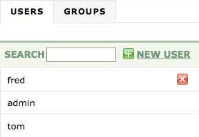
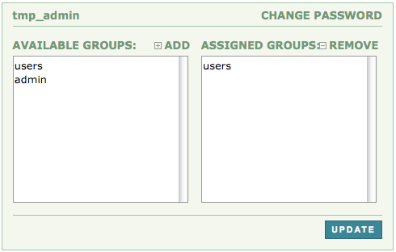
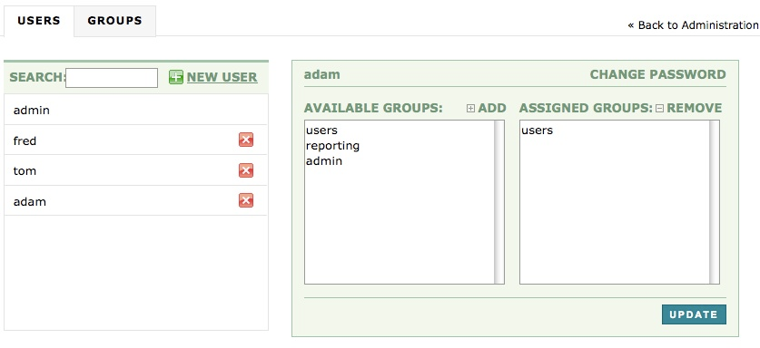

Logged in as: OmniTI, Inc.  ([logout](https://support.messagesystems.com/logout.php))

 

*   [Changelog](https://support.messagesystems.com/start.php?show=changelog)
*   [Documentation](https://support.messagesystems.com/docs/)
*   [Downloads](https://support.messagesystems.com/start.php)

*   [Licenses](https://support.messagesystems.com/license_summary.php)
*   <a href="">Clients</a>
    *   [Support](https://support.messagesystems.com/cs.php)
    *   [Add/Edit](https://support.messagesystems.com/edit_client.php)
    *   [Legal/Products](https://support.messagesystems.com/edit_products.php)
*   [Users](https://support.messagesystems.com/edit_customer.php)

## Search Help

Search for a single word or perform multi-word searches by enclosing your search in quotation marks.

Where you have multiple words but no quotation marks, an **OR** search is performed. For example, **"REST Injection"** searches for the phrase **"REST Injection"**, and, without quotation marks, searches for **REST OR Injection**--the operator is understood.

### Warning

You must escape the following special characters: **+ - && || ! ( ) { } [ ] ^ " ~ * ? : \**. Use the **\** character as the escape character. For example: **B0/00-11719-46C328D4\:default\:**

You can also perform **AND** searches, for example, **rest AND port** (no quotation marks) finds pages where both these words occur.

Terms used in searches are case-insensitive but operators are not. Alphabetic operators **must** be in uppercase.

Other operators can also be used. For more information see "[Query Parser Syntax](https://lucene.apache.org/core/old_versioned_docs/versions/3_0_0/queryparsersyntax.html)". Use of fields in searches is not currently supported.

| 3.9. Administering Users From the Web Console |
| [Prev](web3.administration.php)  | Chapter 3. Using the Web Console |  [Next](web3.policy.editor.php) |

## 3.9. Administering Users From the Web Console

In order to administer users, you must be logged in as a superuser. The user named `admin` created during installation is a superuser. You cannot create superusers through the web UI, use [ec_uipasswd](executable.ec_uipasswd.php "ec_uipasswd") instead.

### Warning

If you choose to authenticate against Active Directory, the User Management menu will be removed from the web UI.

To administer users click the Administration tab and choose the User Management link. This menu is used to create, remove or update users and groups.

If this is the first time that you have logged in to the web console you should see something similar to the following:

**Figure 3.43. Administering users**

To begin adding a new user click the New User button. Supply a username and password and click the Create button to create the new user.

When a user is newly created, you can assign groups to that user as shown in the following:

**Figure 3.44. Assigning groups**

By default, all new users are members of the `users` group. To make a user a superuser, select the `admin` group from the left column and click the ADD button. To apply your changes, click the UPDATE button.

The newly created user should appear below the `admin` user. An X appears to the left on the same line as the new user name. Use this button to delete the user. Notice that you cannot delete the `admin` user. You can, however, change the password for the admin user by clicking on `admin` and entering a new password in the text box that opens on the right side of the page. You can also change the password for regular users in the same way.

You may also use the **ec_uipasswd** command to administer users. You can use this command to give a regular user superuser privileges if you did not do this when the user was created. You can also add users or groups using the **ec_uipasswd** command. If you have forgotten the password for the administrator, you can use this command to create a new superuser in order to log in to the web UI. For more information see [ec_uipasswd](executable.ec_uipasswd.php "ec_uipasswd").

Adding or changing users takes effect immediately and does not require that files be committed. However, the default configuration on nodes is to cache database lookups for a few minutes, so changes to passwords may take a few minutes to take effect.

### 3.9.1. Adding the Reporting Role to a User

**Configuration Change. ** The reporting role is available as of Momentum version 3.3.

By default all new users added through the web UI have access to the reporting menu. To add a user with the reporting role only, create a new user as described in [Section 3.9, “Administering Users From the Web Console”](web3.users.php "3.9. Administering Users From the Web Console") and then select this user from the list of users. You should see something similar to the following:

**Figure 3.45. Reporting Role**

By default, all new users are members of the `users` group. If you wish to create a user with only the reporting role, first remove the `users` role and then add `reporting`.

A user with only the reporting role does not have access to the ADMINISTRATION menu and is not presented with any "Reset", "Purge", "Bounce", "Retry" or "Suspend" buttons. Nor can this user access the node controls from the stats Tab.

### Note

Like the `admin` role, the reporting role is fixed and cannot be removed from the web UI.

**3.9.1.1. The Reporting Role and LDAP**

If you are authenticating using LDAP you cannot add or change users through the web UI. However, you can implement a reporting role by setting up a reporting user role (see [Section 2.3, “Setting Up Active Directory Authentication With Momentum 3.2.2”](conf.ldaps.php "2.3. Setting Up Active Directory Authentication With Momentum 3.2.2")) and by making the changes described below.

Set up an LDAP environment that defines a reporting user role. Substitute the name of that role into the `REPORT_ROLE` configuration option in the `/opt/msys/ecwebui/config/webui-receiving.conf` (or `webui-sending.conf`) file.

### Note

There is an additional configuration option in `/opt/msys/ecwebui/config/webui-receiving.conf` called `REPORT_ROLE_OVERRIDE`. When this option is set to `true` if a user has the "reporting role" and one or more other roles (except the admin role), the reporting role overrides the other roles. This has the affect of stripping the user of privileges associated with other roles.

| [Prev](web3.administration.php)  | [Up](web3.php) |  [Next](web3.policy.editor.php) |
| 3.8. Administration  | [Table of Contents](index.php) |  3.10. The Policy Configuration Editor |

Follow us on:

  